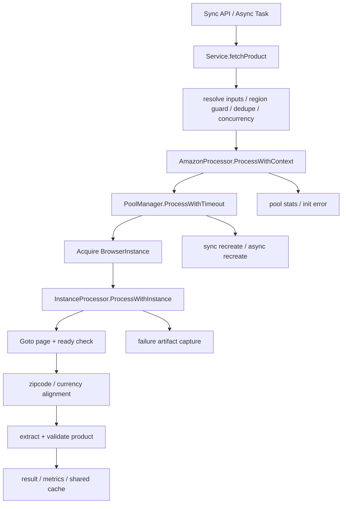

# Amazon Crawler Runtime Flow

本文档描述当前 `internal/crawler/amazon` 运行时主链路，重点回答 3 个问题：

1. 请求从哪里进入
2. 抓取在代码里如何往下走
3. 出问题时应该先看哪一层

目标不是覆盖每个 extractor 细节，而是把“线上失败率高时应该怎么定位”固定成一张可复用的图。

## 1. Runtime Layers

当前 Amazon crawler 可以按 4 层理解：

1. `Service` 层
2. `AmazonProcessor / BatchProcessor` 层
3. `PoolManager / BrowserPool` 层
4. `InstanceProcessor` 层

各层职责：

- `Service`
  - 负责同步 API / 异步任务入口
  - 负责参数归一化、去重、并发控制、`regionGuard`、结果存储、指标汇总
- `AmazonProcessor`
  - 负责处理器生命周期、浏览器池初始化、单请求和批请求入口
- `PoolManager / BrowserPool`
  - 负责实例获取、超时、实例重建、归还、健康检查、池统计
- `InstanceProcessor`
  - 负责单页面导航、页面准备、邮编与货币上下文对齐、数据提取、质量校验、失败样本留存

## 2. Main Entry Points

### 2.1 同步抓取入口

主链路：

1. `Service.FetchProduct(...)`
2. `Service.fetchProduct(...)`
3. `Service.resolveFetchInputs(...)`
4. `Service.fetchProductWithDedupe(...)` 或 `Service.fetchProductDirect(...)`
5. `AmazonProcessor.ProcessWithContext(...)`
6. `PoolManager.ProcessWithTimeout(...)`
7. `InstanceProcessor.ProcessWithInstance(...)`

关键代码：

- [crawler_service.go](D:/code/task-processor/internal/crawler/amazon/crawler_service.go)
- [processor.go](D:/code/task-processor/internal/crawler/amazon/processor.go)
- [pool_manager.go](D:/code/task-processor/internal/crawler/amazon/browser/pool_manager.go)
- [instance_processor.go](D:/code/task-processor/internal/crawler/amazon/instance_processor.go)

### 2.2 异步任务入口

主链路：

1. `Service.SubmitTask(...)`
2. worker pool 消费
3. `AsyncTaskProcessor.ProcessTask(...)`
4. `Service.fetchProduct(...)`
5. 后续链路与同步抓取一致

关键代码：

- [crawler_service.go](D:/code/task-processor/internal/crawler/amazon/crawler_service.go)
- [worker_processor.go](D:/code/task-processor/internal/crawler/amazon/worker_processor.go)

### 2.3 批量入口

当前批量处理已经收敛为“顺序委托单请求链路”，不再自己管理浏览器实例：

1. `AmazonProcessor.ProcessBatchWithContext(...)`
2. `BatchProcessor.ProcessWithContext(...)`
3. 对每个请求回调 `AmazonProcessor.ProcessWithContext(...)`

这意味着：

- 批处理不再拥有第二套实例获取/重建逻辑
- 批处理现在也继承单请求链路的 `ctx`、超时和浏览器池行为

关键代码：

- [batch_processor.go](D:/code/task-processor/internal/crawler/amazon/batch_processor.go)
- [processor.go](D:/code/task-processor/internal/crawler/amazon/processor.go)

## 3. Service Layer Flow

`Service.fetchProduct(...)` 这一层主要做“抓取前后编排”。

### 3.1 输入归一化

`resolveFetchInputs(...)` 负责：

- URL / ASIN 互转
- 默认邮编补全
- 无效请求快速失败

这里失败通常对应：

- `invalid_request`

### 3.2 Region Guard

抓取前先调用 `checkRegionGuard(...)`。

作用：

- 如果某个 region 最近连续出现 captcha / timeout / browser crash 等错误
- 则短时间直接拒绝继续打这个 region

这里失败通常对应：

- `region_circuit_open`

### 3.3 Product Dedupe

如果启用了 dedupe：

1. 先读共享结果
2. 再抢产品级锁
3. 抢到锁的请求负责真实抓取
4. 其他请求等待共享结果

这里最常见的问题：

- 共享结果失效
- 抢锁失败退化为直接抓取
- 等待共享结果超时

这里失败通常对应：

- `crawl_in_progress`

### 3.4 Concurrency Control

`fetchProductDirect(...)` 进入真正抓取前会先做全局并发和 region 并发限流。

这里失败通常对应：

- `system_busy`

## 4. Processor Layer Flow

### 4.1 AmazonProcessor

`AmazonProcessor` 负责：

- 初始化浏览器池
- 构建 `PoolManager`
- 暴露单请求 / 批请求入口
- 聚合 quality / pool / proxy stats
- 关闭时统一回收池和健康检查

这里失败通常对应：

- `processor_unavailable`

常见触发条件：

- Playwright 启动失败
- 浏览器池初始化失败
- 浏览器池管理器未建立

### 4.2 BatchProcessor

现在只负责：

- 接收批量请求
- 顺序调用单请求处理
- 透传 `ctx`

这里理论上不应该再承载复杂错误判断。

## 5. Browser Pool Layer Flow

### 5.1 PoolManager

`PoolManager.ProcessWithTimeout(...)` 负责：

1. 给单次抓取挂总超时
2. 获取实例
3. 调 `InstanceProcessor.ProcessWithInstance(...)`
4. 严重错误时同步重建实例并重试一次
5. 超时路径里强制关闭实例并异步补充

关键点：

- 这是当前唯一应该负责实例编排的地方
- 批处理不再绕开它

### 5.2 BrowserPool

`BrowserPool` 负责：

- 维护可用实例 channel
- 统计池大小、重建成功/失败、初始化失败
- 控制实例轮换
- 管理健康检查

### 5.3 InstanceManager

`InstanceManager` 负责：

- 创建实例
- 同步重建
- 异步重建
- 跟踪活跃重建数

### 5.4 HealthChecker

当前健康检查已改成：

- 不再长期保留常驻 page
- 按需创建临时页做健康探测

这层异常通常对应：

- `browser_crash`
- `timeout`
- `network`

## 6. Single Page Flow

`InstanceProcessor.ProcessWithInstance(...)` 是单页抓取核心。

主链路：

1. `Manager.NewPage()`
2. 导航到目标 URL
3. 处理 `Continue shopping`
4. `WaitForPageReady(...)`
5. 判断是否有效产品页
6. 根据目标站点上下文决定是否设置默认邮编
7. 如有必要，执行 `ZipcodeSetter.SetAndVerifyZipcode(...)`
8. 对齐货币上下文
9. `extractAndValidateProduct(...)`
10. 如启用质量重试，则 reload 后重抓
11. 失败时保存 failure artifacts

关键代码：

- [instance_processor.go](D:/code/task-processor/internal/crawler/amazon/instance_processor.go)
- [product_checker.go](D:/code/task-processor/internal/crawler/amazon/product_checker.go)
- [zipcode_setter.go](D:/code/task-processor/internal/crawler/amazon/browser/zipcode_setter.go)
- [zipcode_input_handler.go](D:/code/task-processor/internal/crawler/amazon/browser/zipcode_input_handler.go)
- [zipcode_validator.go](D:/code/task-processor/internal/crawler/amazon/browser/zipcode_validator.go)

## 7. Most Failure-Prone Sections

结合当前代码和最近一轮重构，最容易出问题的地方通常是：

### 7.1 页面创建和导航

表现：

- `创建页面失败`
- `创建页面超时`
- `导航到页面失败`
- `导航超时`

优先看：

- browser crash
- Playwright WebSocket 断连
- Pod OOM
- 节点资源压力

### 7.2 页面准备

表现：

- `页面未准备就绪`
- `不是有效的产品页面`
- captcha / blocked / 404

优先看：

- `ProductChecker`
- 目标站点是否跳转错国家
- `Continue shopping`
- 页面是否仍停留在异常态

### 7.3 邮编设置

表现：

- `邮编设置失败，终止数据抓取`
- `SIGN_IN_REQUIRED`
- `页面已关闭`
- `邮编更新未生效`

优先看：

- 地址弹层是否变形
- 目标国家推断是否正确
- 当前配送上下文是否其实已经满足
- 页面崩溃是不是在邮编流程里暴露出来

### 7.4 质量重抓

表现：

- `产品数据验证失败`
- `产品质量校验失败且页面重试准备失败`

优先看：

- 货币是否和目标站点一致
- 页面 reload 后是否进入异常态
- extractor 是否拿到了错误上下文的数据

## 8. Error Classification Map

当前最关键的 service 侧错误类型：

- `invalid_request`
- `processor_unavailable`
- `crawl_in_progress`
- `system_busy`
- `region_circuit_open`
- `product_quality`
- `captcha`
- `authentication`
- `browser_crash`
- `network`
- `timeout`
- `server_error`

其中有几类已经收敛成 typed error：

- invalid request
- processor unavailable
- crawl in progress
- system busy

对应代码：

- [fetch_error.go](D:/code/task-processor/internal/crawler/amazon/fetch_error.go)
- [error_detector.go](D:/code/task-processor/internal/crawler/amazon/browser/error_detector.go)

## 9. Monitoring Map

线上排障时建议按下面顺序看。

### 9.1 先看服务层

指标：

- `crawler_fetch_total`
- `crawler_fetch_failure_total`
- `crawler_failure_by_type`
- `crawler_task_submit_failure_total`
- `crawler_dedupe_wait_timeout_total`
- `crawler_region_guard_block_total`

优先回答：

- 是不是任务没进队列
- 是不是 dedupe 在等超时
- 是不是 region guard 在大量挡请求

### 9.2 再看池层

指标：

- `crawler_total_instances`
- `crawler_configured_pool_size`
- `crawler_pool_init_failure_total`
- `crawler_pool_sync_recreate_failure_total`
- `crawler_pool_async_recreate_failure_total`
- `crawler_pool_active_rebuild_total`

优先回答：

- 池有没有缩容
- 初始化是不是失败过
- 重建是不是卡住了

### 9.3 最后看 Pod / 节点层

重点：

- OOMKilled
- 重启次数
- 启动探针失败
- 节点 CPU / 内存
- Redis / DNS 网络抖动

## 10. Runtime Diagram

## 11. Current Practical Rule

如果线上失败率突然升高，优先按这个顺序查：

1. `failure_by_type` 先判断是哪类失败在冒头
2. `configured_pool_size` vs `total_instances` 看池有没有缩
3. `pool_active_rebuild_total` 看重建是不是卡住
4. `task_submit_failure_total` / `dedupe_wait_timeout_total` 看是不是服务层次生故障
5. 再回具体 Pod 日志看页面准备、邮编设置、browser crash 文案

这条顺序的核心是：

- 先分层
- 再定位
- 最后才进具体 selector / extractor 细节
