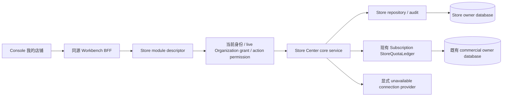

# Store Center 接入 current application v1

状态：`IMPLEMENTATION_READY`（2026-09-28 独立 Architecture Review，无未解决 BLOCKER）。本文是 #552 的设计依据，不是实现或运行验收；正式 Writer 授权仍须满足 Issue「权限与责任」。

执行 Issue：[#552](https://github.com/qq550723504/task-processor/issues/552)。调查基线为 `8478800e31bf2e126bd03fae5ec45536056d823e`；2026-09-28 远端 main 与本地基线一致。独立评审通过后才更新准入状态；Issue 的生产实现授权还须满足其「权限与责任」。

## 1. 产品结果、依据与范围

当前企业的 viewer 可以查看真实店铺，operator 可以创建、编辑和启停店铺记录，admin 可以删除。入口为当前 Console「店铺中心 → 我的店铺」`/workbench/stores`，新建 `/workbench/stores/new`，详情 `/workbench/stores/:storeId`。刷新、切企业、重新登录和应用重启都读相同 Store owner 的持久化事实。

依据顺序：

- #552 当前正文：记录管理、三类状态分离、连接不可用时诚实展示；第一批不开放 Activate/Renew/Reactivate。
- [全新系统产品基线](../product/greenfield-no-legacy-migration.md)、[Legacy Hard-Cut](../refactoring/legacy-hard-cut-policy.md)：全新安装、空业务数据，只有 EXTRACT / RETIRE，无历史兼容义务。
- [最终 UI / IA Authority](../product/final-ui-ia-authority.md)：Figma 文件 `tg48P46SSXl6TBy9lZwg63`、页面 `31:463`。2026-09-28 使用只读 Plugin API 复核可见节点 `429:4243`、`429:4445`（我的店铺深/浅色），`1560:359`、`1560:716`（优化版），以及批量选择实例。设计实例不是平台、服务或统计事实。
- [现有身份/企业空间设计](../superpowers/specs/2026-08-30-shuomi-workbench-store-center-zitadel-multi-org-design.md)、[当前认证边界](auth-and-tenancy.md)：复用 ZITADEL、Effective Organization、当前 route middleware 和 Casbin 权限，不建立 IAM。
- [V7 Resource / Store Service 计划](../superpowers/plans/2026-09-03-shuomi-resource-ledger-store-plan-v7.md)：保留服务/资源当前 owner、原子执行与幂等行为；其中历史迁移、旧 lifecycle 兼容与双状态同步不能成为本轮依据。
- [商业合同](commercial-wallet-billing-contract.md)、[订阅购买合同](self-service-subscription-purchase-contract.md)：本轮消费 Store entitlement，不改套餐、价格、钱包、订单或资源余额。

第一批交付 list/detail/create/update/enable/disable/delete，以及已有 provisioning 的 resume-create；SHEIN 是当前唯一合法 platform。地区、外部店铺 ID 只是用户提供的记录属性，不证明平台授权或真实外部身份验证。

不做店铺商品、订单履约、OAuth/扫码/密码/凭据管理、平台 mutation、发布/采集、网络检测、同步进度、分组/负责人/店铺类型的新持久化能力、支付/续费、自动化恢复平台或专项验收工具。不得把这些作为记录管理的前置。Activate/Renew/Reactivate 在 Go 和 BFF 正式入口都不开放，orgresource 只保留既有边界，不被本批 CRUD 写入。

## 2. 已确认现状与必须处理的根因

| 边界 | 实际代码证据 | 当前缺口 / 处置 |
| --- | --- | --- |
| Console | `web/listingkit-ui/src/components/workbench/stores/*`、`lib/workbench/console-navigation.ts` | 列表/表单/操作已有消费者，菜单 connected 只是静态声明；以运行接线和回读验证可用性 |
| BFF | `app/api/workbench/[...path]/route.ts`、`lib/server/workbench-proxy.ts` | Store allowlist、同源检查、ETag/幂等和严格响应校验已有；同步改为当前状态合同，移除未开放服务操作的正式转发 |
| current application | `internal/app/httpapi/current_application.go`、`internal/app/runtime/currentapplication/{config,runtime}.go` | route inventory、factory、feature、manifest 都没有 Store；不能只在 registry 偷加 routes |
| 旧 builder | `internal/app/httpapi/storecenter_module.go` | `cfg.Database` → OpenShared，Store/quota 共用任意 shared DB；current assembly 禁用这条入口，只注入 owner pools/ports |
| Store persistence | `internal/storecenter/gorm_repository.go` | `compatibilityStateForNewStore/Save` 同写 lifecycle 和 record/service，新创建还写历史 resolution 字段；从当前行为抽取，退休当前路径中的兼容分支 |
| enable 缺陷 | 同上 `compatibilityStateForSave`；`gorm_repository_test.go: TestGormStoreRepositoryRejectsLegacyEnableUntilServiceHistoryResolves` | disabled → active 返回 `ErrServiceResumeRequired`；第一批未开放服务恢复，旧实现会使核心 happy path 无法完成 |
| 配额 | `internal/listingsubscription/store_quota{,_gorm}.go` | 有 durable reservation/allocation/bucket、事务锁和同键 fingerprint；继续唯一 owner，不建立 Store 第二份计数；旧 plan-limit fallback 不进入当前消费者 |
| 服务状态 | `internal/storecenter/service_state.go`、`service_lifecycle.go`、`internal/integration/orgresource/store_service_executor.go` | record/service 已有独立合同，但 core DTO 只有 lifecycleStatus；当前 core 不能冒充服务激活，第一批无服务 mutation |
| 连接 | 旧 builder 的 `unavailableConnectionStatusProvider`、`storecenter/connection_status.go` | 空 ref 会直接投影 disconnected，绕过 provider；没有 authority 时必须可明确表达 unavailable，不能猜 connected |
| 初始化 | 当前 account Compose 只初始化 source/commercial/referral/membership/acquisition/image owners；旧 Store schema 依赖旧入口 | 缺当前空库 Store 初始化、Store runtime role 和窄 quota role；启动不得 AutoMigrate 或自动 seed |

已执行四个现有 focused tests（本地临时 SQLite / 测试替身），结果 PASS：`TestGormStoreRepositoryRejectsLegacyEnableUntilServiceHistoryResolves`、`TestServiceDisableEnableDoNotTouchQuota`、`TestServiceEnablePreservesServiceResumeRequired`、`TestConnectionStatusBlankReferenceIsDisconnectedWithoutProviderCall`。这些只证明现状行为和缺陷成因，不证明新合同或 PG/runtime/browser 通过。

## 3. Owner 与目标调用链

| 事实 / 行为 | 唯一 owner | 注入与消费者 |
| --- | --- | --- |
| Store identity、profile、record status、service snapshot、version、删除与操作审计 | `internal/storecenter` | current Store repository/service → owning `httpapi` → BFF → Console |
| 身份、项目角色、企业 grant 和选择 | `authidentity` / `authruntime/zitadel` / `workbenchcontext` | 现有 current middleware；HTTP body/query 不能提供可信 actor/org |
| Store action permission | `internal/authz` | 现有 Casbin authorizer；UI 只投影，不代替 server admission |
| Store entitlement limit、durable reserved/committed allocation | `internal/listingsubscription` | 向 Store 注入既有 `StoreQuotaLedger`；独立窄凭据池，不借 commercial_reader/runtime 扩权 |
| Store service 的资源扣减和原子 receipt | `internal/ledger/orgresource` / `internal/integration/orgresource` 与 Store service owner | 第一批不装配 executor，不消费服务余额；后续开放必须另行准入 |
| 平台连接事实 | 实际 connection authority | 当前没有获准实现；只注入显式 unavailable provider，不复用旧 session/profile/source account |

app 只完成 factory / route inventory / pool lifecycle / middleware wiring。领域规则、状态转换、限额、审计留各 owner。遵循现有 kernel module/descriptor、GORM、Goose 和当前 BFF/React Query；不新增通用 Provider、Saga、Scheduler 或 IAM 框架。

## 4. Current application 的显式装配

manifest 增加可选 `storeCenter` 区块，仅包含 `database`（Store）和 `quotaDatabase`（既有 commercial DB 的窄 quota role）及 enablement。复用现有 strict manifest 校验，拒绝 duplicate/unknown 配置、相同错误 owner DB、宽角色和 disabled feature 仍注入 pools。凭据继续私密文件交接，不进入浏览器/日志。

runtime 在 bounded startup context 中分别 OpenStoreCenter/OpenStoreQuota，做 schema/权限只读 preflight，再经 `ApplicationFeatures` 和 current application option 传入 builder。Store pool 与 source/commercial/money/referral/product/membership pools 独立；quota pool 连接已存在的 commercial database，不另建 entitlement DB。不允许 Store module 从 `cfg.Database` 开库，也不由 module 关闭借用 pool。

这里的 canonical commercial target 明确为 manifest `commercialOwnerDatabase`，不是 `commercialDatabase` 读投影。启用 Store 时须有明确的 owner target；`storeCenter.quotaDatabase` 规范化后的 host/port/database 必须与它一致，user/credential/role/pool 独立且只具下节窄权限。禁止从 `commercialDatabase` 推定、fallback或允许不同owner目标；两入口实际同一物理库时允许相同target，但不能借用读/宽写pool。匹配配置之外仍须schema及权限preflight。

runtime 持有并唯一关闭两池：任一构造/preflight/listener 错误关闭已打开资源；shutdown 先停止接收并等请求完成，再关闭 pools。复用现有 startup deadline、manifest pool cap、DB statement timeout、server shutdown 协议，不创建后台扫描器。

feature 启用时所有八个 core descriptors 必须完整存在，method/path/module/auth/org-policy/permission 与下节一致；缺项、多挂生命周期 route、typed nil 或 owner preflight 失败则不监听。feature 未启用不挂 Store routes，入口准确显示服务未开放，不把 404 或 dependency unavailable 展示成空列表。

## 5. 路由合同、授权与 freshness

所有 Store routes 使用 `AuthPolicyCurrentIdentity`，禁止 VerifiedIdentity 的旧入口/allowlist 语义。Organization policy 使用现有 `LiveWrite`，包括 GET：#552 要求撤权后新请求 fail closed，故不使用可缓存 60 秒的 CachedRead。LiveWrite 只代表现有 live grant resolution，不表示每个 GET 是写入，也不承诺 grant 与后续 DB 操作存在分布式原子事务。

| Method / `/api/v1/workbench` path | permission | Handler → owner | 前提 / 幂等 |
| --- | --- | --- | --- |
| GET `/stores` | `workbench.store.read` | List → repository scoped page + quota Summary + connection projection | page/pageSize≤100/platform/record status 严格验证，无副作用 |
| GET `/stores/:store_id` | `workbench.store.read` | Get → scoped repository + projection | Store ID、当前 org、deleted 校验；ETag=aggregate version |
| POST `/stores` | `workbench.store.create` | Create → reserve → durable Store/audit → commit → active record | canonical UUID Idempotency-Key；规范载荷 fingerprint；同 org/key 不换 Store |
| POST `/stores/:store_id/resume` | `workbench.store.create` | ResumeCreate → 原 Store/原 quota identity | If-Match；不接受新 create key，不重新绑定或新增 quota |
| PUT `/stores/:store_id` | `workbench.store.update` | Update → 原 mutation intent/CAS/audit | If-Match；只改 name/region；不可改平台、外部 ID、org、资源/连接 |
| POST `/stores/:store_id/disable` | `workbench.store.lifecycle` | Disable → record transition/CAS/audit | If-Match；只切 active→disabled，不改 service/connection/quota |
| POST `/stores/:store_id/enable` | `workbench.store.lifecycle` | Enable → record transition/CAS/audit | If-Match；只切 disabled→active，不要求/执行 Reactivate |
| DELETE `/stores/:store_id` | `workbench.store.delete` | Delete → owned deleting → deallocate → soft delete + audit | If-Match + UUID Idempotency-Key；原操作 identity 恢复 |
| POST `activate/renew/reactivate` | 不装配 | Go descriptor 和 BFF 禁止转发 | 不消费 orgresource、不返回假激活；不是 UI 隐藏即完成 |

viewer=read；operator=read/create/update/lifecycle；admin=以上+delete；platform_admin 仍必须具备当前 enterprise grant 与 verified Effective Organization。复用现有权限表，不扩充 platform override。

BFF 保留 private server session/token、same-origin write checks、strict allowlist、无 redirect fetch、响应 schema、`X-Expected-Organization-ID` 和 request ID。Expected org 只是 compare/fence，不是选择或授权事实。未授权、组织撤权、scope 变化和跨 org Store 在 service 前拒绝；读不到他 org Store 时不泄露其存在。

mutation replay 也重新鉴权。授权后撤权的进行中请求沿现有 freshness 边界，不引入 revoke transaction；撤权后发起的新 Store 请求不得靠旧 UI roles/grant cache通过。

## 6. 唯一当前 Store 状态与 HTTP 投影

当前事实只能来自同一 `workbench_stores` 行，不同时写 `lifecycle_status` 和 `record_status`。按 #552 的记录启停语义，canonical `record_status` 为 `provisioning / active / disabled / deleting / deleted`；`disabled` 是当前记录不可使用，不是 paid service suspended。既有 record-status 合同补足 disabled 值，服务 owner 的 Activate/Renew/Reactivate 对 disabled 继续拒绝。不会因此延长/重置服务期限或恢复 paid service。

| 记录动作 | Record effect | Service effect | Quota effect |
| --- | --- | --- | --- |
| Create reservation / persisted provisioning | provisioning | 尚无服务，nullable state | reserved +1 |
| Commit quota + finalize create | active | 同一 Store 行显式初始 `pending_activation`，无期限 | reserved→committed |
| Update profile | 不变 | 不变 | 不变 |
| Disable / Enable | active↔disabled | 严格不变，包括 paid timestamps | 不变 |
| BeginDelete | deleting | 复用当前删除合同，清除服务状态/期限；不退期、不返资源 | 尚未释放 |
| Deallocate / SoftDelete | deleted + deleted_at | 无服务 | committed→released，至多一次 |

禁止根据 active 推导 service active、根据 disabled 推导 suspended、根据过期墙钟自行保存新状态，或者根据 record existence 推导 connected。Store service 执行器仍是未来服务变更唯一 owner，本批不增加第二 executor。

HTTP Store DTO 同时返回 `recordStatus`、`serviceStatus`（provisioning/deleting 可为 null）、`serviceStartedAt/serviceExpiresAt`（pending 无期限）、`connectionStatus` 与既有 profile/version/time。删除仍不返回可用 Store；读出缺失/非法当前 record state fail closed。移除 `lifecycleStatus` 的正式 browser/BFF 合同，所有当前 Store 消费者在同一候选中切换，无 alias/fallback/双 DTO。其他服务 prepared-only 消费者必须完成编译与受影响合同核对，不把没装配的服务顺手开放。

connection provider 必须决定当前能力；本批 unavailable provider 对所有 Store 返回 unavailable，空 connectionRef 也不绕过 provider。未来真实 authority 自己判断无绑定 ref 的 disconnected/expired/connected；仍复用 500ms bounded call 和最多 8 个并发读。连接 capability 没开放时，UI 明确“平台连接未开放”；不显示“授权正常/网络正常/可上架”。

服务字段来自同一持久化 owner，可显示“待激活”；同时 UI 固定说明“店铺服务尚未开放”，不提供 Activate/Renew/Reactivate 或购买服务按钮，不显示 Figma 示例期限。没有合法服务事实时不填默认 active/pending。新建后“记录已创建”不能写成“绑定并授权成功”。

## 7. 数据库、初始化与最小权限

Store database 使用独立 schema owner + `store_center_runtime`。复用当前 `workbench_stores` 与 `workbench_store_audit_logs` 身份、唯一键、CAS、软删和安全审计；不新建第二 Store 表，不复制旧 ListingKit 店铺数据。全新 schema 只安装当前 record/service 字段及既有 identity/version/provenance/idempotency 字段，不安装 lifecycle_status、历史 resolution/backfill 字段或旧索引。

新的显式 Store schema entrypoint 复用当前 Goose schema-owner 命令模式，仅安装空库当前合同。它是正常新系统初始化，不执行历史数据库 ALTER/backfill/cutover；遇到旧/非当前 schema 拒绝并报告，绝不自动删除或重置。runtime 的 VerifySchema/VerifyRuntimePermissions 只读，缺列/约束/索引或错误角色均 fail closed；不得 serve 时 AutoMigrate。

| pool / role | 允许 | 禁止 |
| --- | --- | --- |
| Store schema owner | 独立初始化当前 Store schema/role grants | runtime 使用 owner 凭据；初始化他 owner 数据 |
| `store_center_runtime` / Store DB | CONNECT、schema USAGE；stores SELECT/INSERT/UPDATE（软删）；audit SELECT/INSERT，既有 append-only行为 | CREATE、DDL、物理 DELETE、audit UPDATE/DELETE、访问别的业务 DB |
| `store_quota_runtime` / 已有 commercial DB | quota allocations/buckets SELECT/INSERT/UPDATE；canonical tenant entitlement SELECT | 套餐/权益/钱包/余额 mutation、DDL、其他业务表读写；不增加 commercial_runtime/read role 的权限 |

quota 两表由 Subscription owner 的窄 schema entrypoint 安装（复用现有 `AutoMigrateStoreQuotaLedger` 对应事实结构及 current initializer，正式使用显式 owner migration），角色/校验也留 Subscription owner；不是 Store builder 从 Store DB 重建一套商业表。#478 当前权益开通合同未变，本批不预置任何 entitlement、免费 quota 或 welcome resource。

`StoreQuotaLedger` 继续使用 `store_management/store_count` 的有效 canonical entitlement。missing/expired/disabled/非法 limit 明确 subscription_required 或 dependency unavailable；不从 plan_modules 补猜缺失 count。limit 是许可容量；实际 used/reserved 来自既有 allocation/bucket，列表总数来自 Store scoped query，三者不可互换。完整 entitlement 是现有购买 owner 的责任；若当前购买无法产生合法 Store entitlement，回报原 owner，不在本批造套餐或余额。

## 8. 事务、幂等、失败与恢复

先评估共享事务：Store 与 Subscription 是独立 database/pool owner，不能把两个 GORM transaction 当一份原子事务。既有 StoreQuotaLedger 已具有事务 reservation、Store/operation 身份、CAS lease、bucket lock、fingerprint 和 readback 协议，复用它；不新建 Saga/outbox/reconciler。服务 Store+Resource 原子事务是不同边界，本批不调用。

现有 `internal/integration/orgresource/store_service_executor.go` 把 Store repository 和 Resource repositories 注入同一 `tx`，要求Store行与资源行同库。新独立Store database不能直接使用该executor完成跨库原子激活/恢复；本批不装配它或服务routes，因此不阻塞core CRUD。未来真实服务任务须重新确认当前持久化owner和原子性、connection authority及产品开放条件，独立准入；不能只打开开关、复制Store行或偷偷移动现有资源数据。

| 中断 / 并发点 | Durable result / 后续动作 | 唯一责任方 |
| --- | --- | --- |
| reserve 响应丢失 | 同 org/create key 重读 allocation/fingerprint，复用原 StoreID | Subscription ledger；Store Create 协调 |
| Store insert 失败或结果不明 | 有证据确认失败才 release reservation；未知不释放、不换键，scoped readback 或同键重试 | Store Create + audit；禁止 UI 判定失败即新建 |
| quota commit 失败/响应丢失 | 保留 provisioning/reservation，原 create key 或 resume 收敛；不显示已启用 | 原 Store create owner |
| finalize active/audit 失败 | 读原 version/state/intent；补完成同一操作，不二次分配或恢复新服务 | Store mutation/creation owner |
| update/enable/disable CAS 冲突 | 409 + 重新读最新 version；同 action/org/store/expectedVersion 的原 durable intent 和 payload fingerprint重放 | Store mutation owner |
| delete deallocate/soft-delete/audit 中断 | 保留 deleting + 原 delete key；同键重试与 scoped readback，不重复释放额度，不新建恢复 API | Store Delete owner |
| replica 并发 / restart | durable unique keys、bucket transaction locks、Store version CAS；process mutex 只是优化 | 原 repository/ledger |
| 取消/超时/晚到响应 | 未知副作用保持原操作身份；切企业不把 A 结果写入 B cache/UI | BFF + 原 keyed mutation/query owner |

自动恢复只保留既有 `reconcileOrphanedReservations`：Reserve admission 受阻时查询旧 reservation，只有原终止失败审计 + 确认 Store 不存在 + timestamp fence 才释放。重启本身不擅自扫描/释放；其它中断由同键重试/已有 resume/delete 路径处理。未确认失败不得当作完成补偿。

响应丢失后的 update/enable/disable 沿现有 deterministic mutation intent 及 version fence；create/delete 沿原 UUID key 和不可变请求。相同键不同 payload 冲突，已删除 create key 不复活。网络异常不接受 UI “换个 key 再试”。

审计记录当前 record 字段与安全变化，不存 token、password、connectionRef 或任意外部载荷。保持既有 operation provenance（包括跨 actor 合法恢复沿原 intent 的写入身份）；UI 删除不建议“直接 SQL 恢复”——没有获准恢复产品。

请求边界沿现有 ≤16KiB、严格 JSON、name≤120 code points、region≤64、external ID≤128、pageSize≤100、If-Match正整数。BFF Store deadline 15s，Go read body cap/timeout、DB deadline 与 bounded startup/shutdown 复用当前设施；不以本任务建设全局 admission control。失败结果不得包含 DSN/凭据。

## 9. Figma → 页面 → API → owner / gap

| 可见设计 / 用户动作 | 当前消费者 | API / fact | 第一批结果 |
| --- | --- | --- | --- |
| 我的店铺与当前企业 | StoreListPage / current Console | live org + Store List | 当前企业 scope，loading/empty/denied/error；无 mock |
| 已绑定店铺数量、额度 | Store list metrics / quota summary | Store pagination.total；quota used/reserved/limit | 文案分别为记录总数/配额；不把筛选总数/limit说成已授权店铺数 |
| 新建 / 管理店铺 | StoreForm / StoreDetailPage | Create/Get/Update | 真实持久化、读权限可看详情，编辑权限控制表单/操作；成功表述仅记录创建 |
| 记录启停 / 删除 | StoreLifecycleActions | record mutation / Delete | 版本冲突、原 key retry、删除确认；无直接 SQL 恢复建议 |
| 授权/网络/检测/同步/期限 | StoreTable / detail 状态 | connection authority unavailable；真实 service snapshot | 三种状态分开；未开放能力明确不可用，无示例进度/IP/期限 |
| 类型 / 分组 / 负责人 / 高级搜索 | Figma示例，目前无 current fact/搜索合同 | 无 owner | 不建立新事实或仅筛当前页的假全局搜索；不开放这些控件 |
| 店铺商品 / 订单履约 | Console导航 | 本批无业务 owner消费 | 延续未开放状态，不占位成已交付 |
| desktop / narrow viewport | 现有 Console/Card/Form/Dialog | 同一数据链 | 验证 1440 与 390px、键盘、长名称、错误/删除对话框；不另建 UI框架 |

React Query keys 保留 org+StoreID/filters；mutation 捕获 org/key/payload，取消/切换时不把晚到结果显示到新 org。详情在最初 context 尚未加载时不能把空 org 当永久快照，viewer 的详情不得因缺 update权限误报“没有编辑权限”而阻断 read。

## 10. 实现范围、Legacy 与验证

一个唯一 Writer、独立 worktree/主分支、一个主要实现 PR。连续完成当前 Store状态抽取 → pools/schema/permissions/模块接线 → BFF/消费者 → focused self-check。小步骤可独立提交，不因内部 owner数机械拆PR。涉及的新状态、持久化、授权与跨 DB quota 边界在本设计的 Independent Architecture Review覆盖；形成完整路径后做一次最终独立交付检查，修复只复核增量。

Legacy decision: **EXTRACT / RETIRE**

- Reusable behavior：Organization scoped Store identity/profile、分页、CAS、quota reserve/commit/deallocate、durable intent/audit、删除与同键恢复、当前 Console/BFF。
- Current owner：Store Center + 现有 Subscription StoreQuotaLedger + app assembly；不 Wrap root ListingKit或旧 mixed builder。
- RETIRE：current path 的 lifecycle↔record/service双写、历史 resolution/backfill/null fallback、plan-limit补猜、旧 module自开shared DB、旧DTO和面向旧实现细节的测试。服务/资源当前 owner 不因退休旧模式而整体删除。
- Cutover/deletion condition：全部当前 Store消费者同一候选切换后，旧contract/constructor/compatibility代码不再由本批 runtime消费；静态guard不放宽。prepared lifecycle未开放，未来不得通过重新启用旧builder恢复兼容。任何现存真实外部兼容义务必须提供当前证据并报告用户，不自行迁移或保留fallback。

必要开发自检使用 TDD：先有能捕获目标缺陷的 RED，再最小修复。重点为真实 PostgreSQL fresh schema /窄角色下 create→disable→enable→delete，记录启停不改变 service/quota，单状态持久化和同键readback；不能用只通过的 memService替身验证 SQL happy path。

| Must / 风险 | 适用证据（实现阶段） |
| --- | --- |
| 当前 core完整接线，非legacy | current route inventory/factory/startup/shutdown tests，八route与服务route缺席，错误owner拒绝 |
| record状态与服务独立 | domain/PG读写，pendingActivation原值保持；Enable不再ServiceResumeRequired；无旧columns/dualwrite |
| 店铺隔离与角色/撤权 | actual current middleware + Store handlers A/B、viewer/operator/admin、expected org、live revoke/replay denied |
| 唯一quota owner | PG窄quota角色、并发limit、同键异payload、missing entitlement拒绝；不改paid entitlement/资源余额 |
| 失败/重试/restart | 复用既有mutation/lease/audit tests；受影响PG create/delete中断回读；原key恢复 |
| 状态真实/前端scope | DTO/BFF schema、provider unavailable、React Query晚到/切企业、viewer详情、正常导航操作 |
| 可操作交接 | 现有Console 1440/390px/keyboard路径；独立实例正常启动命令和私密登录说明；无自行shared部署 |
| 最终稳定候选 | 当前必要CI与独立diff/路径检查；其余不相干全量测试不重复手工运行 |

当前阶段：文档/静态调查与上列4个基线test已执行；新合同、PG、runtime、browser、产品验收均 `NOT_RUN`。实现者不得以自检或CI替代用户验收。#551已绑定店铺数可以后续消费Store owner真实总数，当前不改账户聚合API或接管另一Writer；#545匿名采集不增加Store前置。

## 11. 独立评审与停止点

评审读取当前Product Decisions/Scope/Must，不把连接平台、服务续费、分组或验收平台加入第一批Must。Finding按项目 `BLOCKER / IMPLEMENTATION_TEST / BACKLOG / ACCEPTED_RISK / NOT_APPLICABLE`分类；只有明确现有Blocker后果才重开设计。

本次优先复核：唯一状态与record启停是否满足#552，旧服务不会被记录Enable意外恢复；两个数据库owner的持久化与quota恢复；live企业grant与角色；当前schema/窄role；未知副作用同键恢复；Figma示例未冒充事实。

独立Reviewer `store_architecture_review` 已对候选 `b9167e9cb0108b4f54a15c5a866f512408a7837a` 完成第1轮Architecture Review，结论：无当前#552架构BLOCKER，`IMPLEMENTATION_READY`。上文canonical quota target与服务executor同库限制是本轮集中澄清；滚动最终HEAD/CI和增量复核证据写PR。

| Finding | 当前requirement / 分类 | 理由与action |
| --- | --- | --- |
| quota的“commercial DB”须区分canonical owner和read projection | 单一商业fact owner / IMPLEMENTATION_TEST | 上文明确匹配commercialOwnerDatabase；实现时验证wrong target、窄role、schema后才监听；不放宽商业读role |
| 后续服务executor只支持Store+Resource同库 | 服务未开放，不是本批Must / BACKLOG | 本批不挂服务routes/executor；未来服务任务另行准入，不把既有同库transaction当跨库事务 |

达到 `IMPLEMENTATION_READY`只表示这份设计允许进入正式实施准入，不表示代码已接入、已部署或产品验收。#552现有权限还要求指定唯一生产Writer，未授权时继续停在架构交接；merge/deploy/Issue close/真实provider及共享数据操作均不授权。
