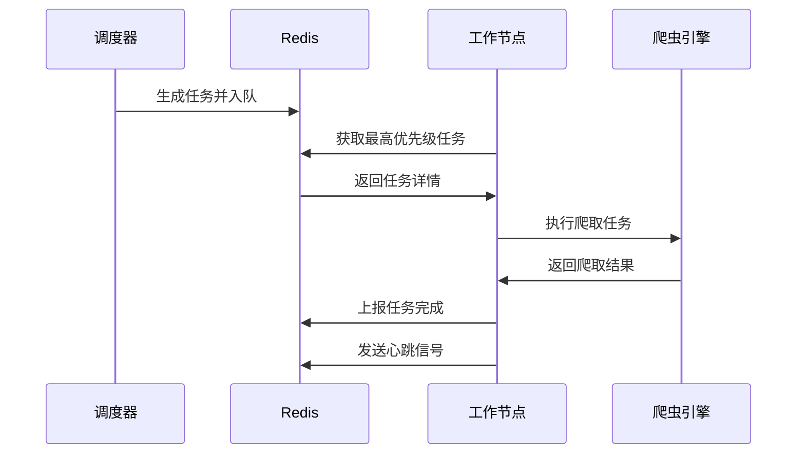
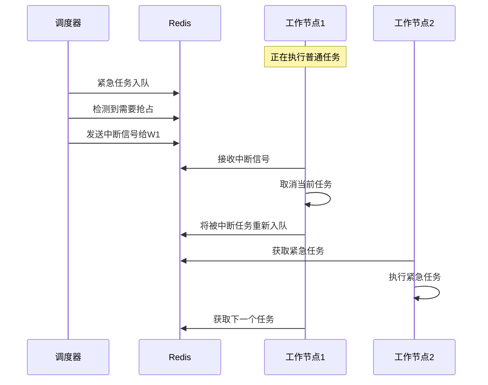

# 分布式优先级爬虫系统设计方案

## 📋 概述

本文档描述了一个支持优先级任务调度的分布式Amazon爬虫系统设计方案。该系统解决了多台无公网IP电脑协同工作，并支持高优先级任务抢占执行的需求。

## 🎯 核心需求

1. **分布式部署**：多台本地电脑作为爬虫节点，无需公网IP
2. **优先级调度**：支持任务优先级，高优先级任务可抢占执行
3. **任务不间断**：所有节点持续处理任务，保持高效运行
4. **故障恢复**：节点故障时任务自动重新分配
5. **实时监控**：提供完整的监控和调试功能

## 🏗️ 系统架构

### 整体架构图

```
┌─────────────────────────────────────────┐
│           云服务器 (中心节点)              │
│  ┌─────────────┐  ┌─────────────────┐   │
│  │   Redis     │  │  任务调度器      │   │
│  │  (消息队列)  │  │ TaskScheduler   │   │
│  └─────────────┘  └─────────────────┘   │
│  ┌─────────────┐  ┌─────────────────┐   │
│  │  监控面板    │  │   配置中心      │   │
│  │ Dashboard   │  │ ConfigCenter    │   │
│  └─────────────┘  └─────────────────┘   │
└─────────────────────────────────────────┘
              ↕ (HTTPS/WSS)
┌─────────────────────────────────────────┐
│              本地爬虫节点                │
│  ┌─────────────┐  ┌─────────────────┐   │
│  │ 任务消费者   │  │  Amazon爬虫     │   │
│  │TaskConsumer │  │   Crawler       │   │
│  └─────────────┘  └─────────────────┘   │
│  ┌─────────────┐  ┌─────────────────┐   │
│  │  心跳服务    │  │   结果上报      │   │
│  │ HeartBeat   │  │ ResultReporter  │   │
│  └─────────────┘  └─────────────────┘   │
└─────────────────────────────────────────┘
```

### 核心组件

#### 云服务器组件
- **Redis**: 任务队列、配置存储、结果缓存
- **任务调度器**: 生成和分发爬取任务
- **中断控制器**: 管理任务抢占和中断
- **监控面板**: Web界面实时监控系统状态
- **API网关**: 提供RESTful接口

#### 本地节点组件
- **优先级工作器**: 双线程任务处理模型
- **任务执行器**: 具体的爬虫执行逻辑
- **中断监控器**: 监听和处理中断信号
- **心跳服务**: 定期上报节点状态

## 🎯 优先级设计

### 优先级等级定义

```
URGENT  (1-100)   → 立即执行，可中断当前任务
HIGH    (101-200) → 优先执行，等待当前任务完成  
NORMAL  (201-300) → 正常队列
LOW     (301-400) → 空闲时执行
```

### 优先级计算公式

```go
// 基础优先级 + 老化加成 + 重试惩罚
finalPriority = basePriority - (waitTime/3600)*10 + retryCount*20
```

### 任务处理策略

1. **抢占式**：URGENT级别可以中断正在执行的任务
2. **非抢占式**：HIGH级别等待当前任务完成后优先执行
3. **老化机制**：长时间等待的任务自动提升优先级
4. **负载均衡**：避免所有节点都抢同一个高优先级任务

## 🔧 Redis数据结构设计

### 核心队列结构

```redis
# 优先级任务队列 (ZSET: score越小优先级越高)
ZADD crawler:tasks:queue 50 "task_urgent_001"     # 紧急任务
ZADD crawler:tasks:queue 150 "task_high_002"      # 高优先级
ZADD crawler:tasks:queue 250 "task_normal_003"    # 普通任务

# 任务详情 (HASH)
HSET crawler:tasks:details task_urgent_001 '{"url":"...", "type":"urgent_crawl", "created_at":"..."}'

# 正在执行的任务 (HASH)
HSET crawler:tasks:running task_urgent_001 '{"node_id":"node_001", "start_time":"...", "can_interrupt":true}'

# 节点状态 (HASH)  
HSET crawler:nodes:status node_001 '{"current_task":"task_normal_003", "status":"busy", "last_heartbeat":"..."}'

# 中断信号队列 (LIST)
LPUSH crawler:interrupt:node_001 '{"task_id":"task_123", "reason":"higher_priority_task_available"}'
```

### 监控统计

```redis
# 统计各优先级任务数量
ZCOUNT crawler:tasks:queue 1 100      # 紧急任务数
ZCOUNT crawler:tasks:queue 101 200    # 高优先级任务数
ZCOUNT crawler:tasks:queue 201 300    # 普通任务数
ZCOUNT crawler:tasks:queue 301 400    # 低优先级任务数

# 性能指标
HSET crawler:metrics throughput_per_min 150
HSET crawler:metrics avg_wait_time_urgent 5.2
HSET crawler:metrics interrupt_count_today 23
```

## 💻 技术实现

### 项目结构

```
/cmd/
├── scheduler/          → 调度器主程序
│   └── main.go
└── worker/            → 工作节点主程序
    └── main.go

/internal/
├── scheduler/         → 调度器核心逻辑
│   ├── priority_queue.go      # 优先级队列管理
│   ├── task_dispatcher.go     # 任务分发器  
│   ├── aging_manager.go       # 老化管理器
│   └── interrupt_controller.go # 中断控制器
├── worker/           → 工作节点核心逻辑
│   ├── priority_worker.go     # 优先级工作器
│   ├── task_executor.go       # 任务执行器
│   ├── interrupt_monitor.go   # 中断监控器
│   └── heartbeat_service.go   # 心跳服务
├── model/            → 数据模型
│   ├── task.go
│   ├── node.go
│   └── metrics.go
└── utils/            → 工具函数
    ├── redis_client.go
    └── logger.go
```

### 核心接口定义

```go
// Task 任务模型
type Task struct {
    ID          string            `json:"id"`
    URL         string            `json:"url"`
    Type        string            `json:"type"`
    Priority    PriorityLevel     `json:"priority"`
    Params      map[string]interface{} `json:"params"`
    CreatedAt   time.Time         `json:"created_at"`
    RetryCount  int               `json:"retry_count"`
    CanInterrupt bool             `json:"can_interrupt"`
}

// PriorityLevel 优先级等级
type PriorityLevel int

const (
    URGENT PriorityLevel = iota + 1
    HIGH
    NORMAL  
    LOW
)

// InterruptSignal 中断信号
type InterruptSignal struct {
    TaskID    string    `json:"task_id"`
    Timestamp time.Time `json:"timestamp"`
    Reason    string    `json:"reason"`
}

// NodeStatus 节点状态
type NodeStatus struct {
    NodeID       string    `json:"node_id"`
    Status       string    `json:"status"` // idle, busy, offline
    CurrentTask  string    `json:"current_task"`
    LastHeartbeat time.Time `json:"last_heartbeat"`
    TasksCompleted int     `json:"tasks_completed"`
}
```

## 🚀 部署方案

### 云服务器配置

**推荐配置：**
- **CPU**: 2核
- **内存**: 4GB 
- **带宽**: 5Mbps
- **存储**: 40GB SSD
- **预估费用**: 100-150元/月

**部署组件：**
```bash
# Docker Compose 部署
version: '3.8'
services:
  redis:
    image: redis:7-alpine
    ports:
      - "6379:6379"
    volumes:
      - redis_data:/data
      
  scheduler:
    build: ./cmd/scheduler
    ports:
      - "8080:8080"
    depends_on:
      - redis
    environment:
      - REDIS_URL=redis:6379
      
  dashboard:
    build: ./web/dashboard
    ports:
      - "3000:3000"
    depends_on:
      - redis

volumes:
  redis_data:
```

### 本地节点部署

**配置文件 (config.yaml):**
```yaml
server:
  url: "https://your-server.com"
  token: "your-node-token"
  
node:
  id: "node_001"
  max_concurrent_tasks: 3
  heartbeat_interval: 30s
  
crawler:
  user_agents:
    - "Mozilla/5.0 (Windows NT 10.0; Win64; x64) AppleWebKit/537.36"
  proxy_pool:
    - "http://proxy1:8080"
    - "http://proxy2:8080"
  request_delay: "2s"
```

**启动脚本:**
```bash
#!/bin/bash
# start_worker.sh

# 编译程序
go build -o worker ./cmd/worker

# 启动工作节点
./worker -config config.yaml -log-level info
```

## 📊 监控和调试

### 实时监控指标

```go
// Metrics 监控指标
type Metrics struct {
    TasksInQueue     map[string]int     // 各优先级任务数量
    NodesStatus      map[string]string  // 节点状态
    AvgWaitTime      map[string]float64 // 平均等待时间
    InterruptCount   int                // 中断次数
    ThroughputPerMin int                // 每分钟处理任务数
    ErrorRate        float64            // 错误率
}
```

### Web监控面板

**功能特性：**
- 实时任务队列状态
- 节点运行状态监控
- 任务执行统计图表
- 优先级分布饼图
- 错误日志查看
- 手动任务管理

**API接口：**
```http
GET /api/metrics              # 获取系统指标
GET /api/nodes               # 获取节点列表
GET /api/tasks/queue         # 获取队列状态
POST /api/tasks              # 手动添加任务
DELETE /api/tasks/{id}       # 删除任务
POST /api/nodes/{id}/restart # 重启节点
```

## 🔄 工作流程

### 正常任务处理流程



### 高优先级任务抢占流程



## ⚠️ 注意事项和最佳实践

### 任务中断处理

1. **安全中断点**：在HTTP请求间隙检查中断信号
2. **数据保护**：中断前保存已爬取的部分数据
3. **状态恢复**：被中断任务重新入队时保持状态

### 防反爬虫策略

1. **IP轮换**：每个节点使用不同代理池
2. **请求频率控制**：分布式限流避免触发封禁
3. **User-Agent轮换**：各节点使用不同浏览器标识
4. **会话管理**：维护独立的Cookie和Session

### 性能优化

1. **批量操作**：批量获取任务减少Redis访问
2. **本地缓存**：缓存配置信息减少网络延迟
3. **连接池**：复用HTTP连接提高效率
4. **智能预取**：预先获取下一个任务

### 故障恢复

1. **心跳检测**：及时发现节点故障
2. **任务超时**：超时任务自动重新分配
3. **优雅关闭**：节点关闭前完成当前任务
4. **数据备份**：定期备份重要数据

## 💰 成本分析

### 云服务器成本
- **基础配置**: 100-150元/月
- **流量费用**: 约20-30元/月 (基于1万任务/天)
- **存储费用**: 约10元/月

### 总体成本
- **月度总成本**: 约130-190元
- **单任务成本**: 约0.004-0.006元
- **ROI**: 相比单机运行，效率提升3-5倍

## 🎯 扩展计划

### 短期优化 (1-2个月)
1. 完善监控面板功能
2. 优化任务分配算法
3. 增加更多反爬虫策略
4. 性能调优和压力测试

### 中期扩展 (3-6个月)
1. 支持多种爬虫类型 (eBay, Walmart等)
2. 增加机器学习反爬虫检测
3. 实现智能负载均衡
4. 添加数据分析功能

### 长期规划 (6-12个月)
1. 支持容器化部署 (Kubernetes)
2. 实现多地域分布式部署
3. 增加AI辅助的任务优化
4. 构建完整的数据处理管道

## 📝 总结

本方案提供了一个完整的分布式优先级爬虫系统设计，具有以下优势：

1. **高可用性**：分布式架构，单点故障不影响整体运行
2. **智能调度**：支持优先级抢占，确保重要任务及时处理
3. **易于扩展**：可随时增减节点，灵活应对业务需求
4. **成本可控**：只需一台小配置云服务器作为中心节点
5. **监控完善**：提供全面的监控和调试功能

该系统可以显著提升爬虫效率，同时保持良好的可维护性和扩展性。