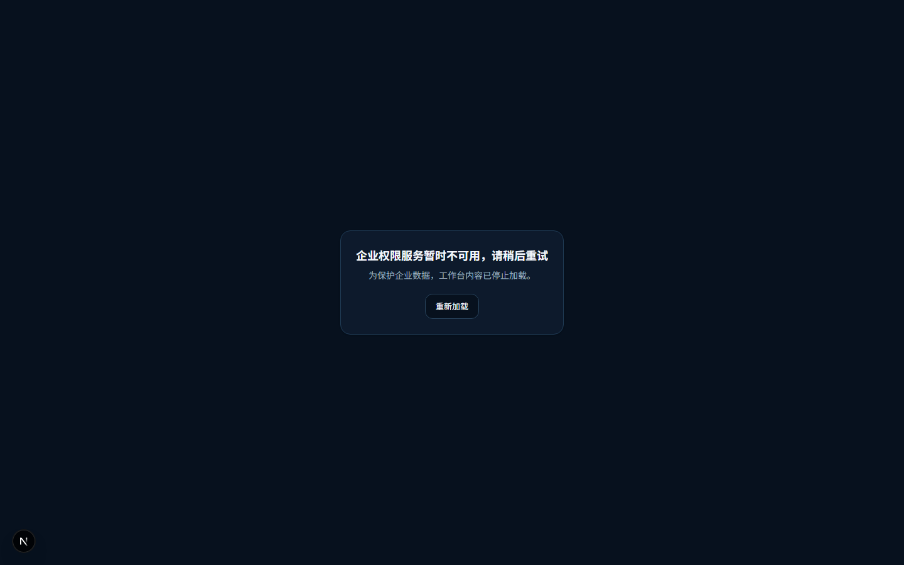

# FV1：统一 Console 视觉与共享框架验收

依据：[#331](https://github.com/qq550723504/task-processor/issues/331)、[FV1命令](https://github.com/qq550723504/task-processor/pull/332#issuecomment-5558090979)。验收起点 `46cc521ab34ce4d35ef358ed064d3b7d1b74771d`，base `8a1a2d02afd2a70e7515a899237832c9bcf1d406`。唯一实现分支仍为 `codex/issue-331-console-foundation`，未写 #328 / #330 或 #327 独占文件。

本轮实际浏览器运行源码 SHA：**`95b19b88027c4e8cfba9bd3ae9ede80fa91d1988`**。其后只追加本报告/截图及文档入口，最终HEAD完整SHA见PR；源码树不变，因此不为证据提交反复拍图。修复前图对应验收起点。未合并、未部署、未关闭Issue。

## Figma当前终稿与页面对照

2026-09-06 16:43–16:46（Asia/Singapore），重新读取 `tg48P46SSXl6TBy9lZwg63` / `31:463` 的四个主要Frame：design context（含属性）和1440×900截图。四张新PNG的SHA256均与仓库原参考图相同，没有观察到终稿变更；沿用已核验的可见/隐藏导航分类，不另起设计。

| Frame | Figma参考图 | 本轮实际运行图 |
| --- | --- | --- |
| 393:321 驾驶舱 | [参考](evidence/issue331/figma-393-321.png) | [1440](evidence/issue331/fv1/overview-1440.png) / [390](evidence/issue331/fv1/overview-390.png) |
| 427:2467 Chat | [参考](evidence/issue331/figma-427-2467.png) | [1440](evidence/issue331/fv1/chat-1440.png) / [390](evidence/issue331/fv1/chat-390.png) |
| 1560:359 我的店铺优化版 | [参考](evidence/issue331/figma-1560-359.png) | [1440，HTTP合同fixture](evidence/issue331/fv1/stores-1440.png) / [390](evidence/issue331/fv1/stores-390.png) |
| 411:323 浅色驾驶舱 | [参考](evidence/issue331/figma-411-323.png) | [1440](evidence/issue331/fv1/overview-light-1440.png) |
| 诊断，无对应Figma终稿 | 只验证共同框架消费 | [1440，实际BFF/Go/PG](evidence/issue331/fv1/diagnostic-1440.png) / [390](evidence/issue331/fv1/diagnostic-390.png) |

关键区域逐项结论（原详细尺寸差异仍见[基础映射](console-foundation.md#同视口设计对照)）：

| 区域 | FV1结论及分类 |
| --- | --- |
| 品牌、侧栏、顶栏 | 42px导出品牌、240px侧栏、72px顶栏；同一Shell；实际企业选择器是明确的工程补充。PASS |
| 分级导航 | 当前10一级，二/三级按可见原稿；展开与链接分离，路由精确选中；浏览器返回、面包屑及移动Escape/焦点链通过。PASS |
| 字体、色彩、主题 | 同一语义变量作用域，深浅主题可切换并持久化；Noto Sans SC缺失时使用系统中文字体，保留已说明的字重/抗锯齿差异。无新增整套视觉偏差。PASS |
| 间距、容器、模板 | 主区28–32边距、概览四列/双列、Chat三色卡片、Store筛选/卡片、诊断结果共同消费；Store显式标签使工具栏高于原稿，属于现有合同展示差异。PASS |
| 未接入业务 | 概览/Chat不伪造GMV、会话或执行结果；禁用全局操作无通知计数。数据缺失不作为视觉修复理由。NOT_APPLICABLE于样本数据逐像素比较 |
| 390px | 工程响应式，不称Figma移动终稿；无水平溢出、axe通过，企业/代管、键盘与焦点可达。PASS |

## 两个候选缺口及处置

| Finding | 实际证据 | 分类 / owner / 处置 |
| --- | --- | --- |
| Shell加载/访问失败脱离Console变量 | 旧源码计算背景为 `#09090b`，正常Console为 `#07111e`；测试先失败 | IMPLEMENTATION_TEST，shared Shell owner：将唯一 `.console-theme` 从WorkbenchFrame上移到工作区ApplicationFrame，覆盖所有门禁；provider相对顺序及认证生命周期不变 |
| 失败卡片边框没有消费变量 | 上移作用域后仍为 `rgb(243,247,252)`，目标为 `rgb(32,60,86)`；新增断言先失败 | IMPLEMENTATION_TEST，同owner：现有卡片仅补 `border-border`；修复后通过，不另建状态组件/主题系统 |
| 无企业页面 | 起点测试已通过，原本就在WorkbenchFrame主题内 | NOT_APPLICABLE：未复现缺口；保留门禁与说明，纳入回归，不扩大布局改造 |
| Toast固定浅色class | 静态样式确为固定浅色，但整个src只有私有 `toastContext`，无导出hook/API和消费者；实际页面Toast容器为空，无法触发可见通知 | BACKLOG，`components/providers/toast-provider.tsx` owner：未来开放消费者时映射既有tokens并加深浅/非工作区测试。当前不构成可见Must缺陷，不新增通知接口来制造复现。外层作用域调整后该现有容器也在Console变量范围内，但不声称已修其固定class |

### 关键区域修复前后

无专用Figma门禁Frame：以下对比的是共同设计变量，而不是伪造页面来源。

| 状态 | 修复前 | 修复后 |
| --- | --- | --- |
| 加载 | [起点](evidence/issue331/fv1/before-fv1-loading.png) | [统一背景/文字](evidence/issue331/fv1/fv1-loading.png) |
| 访问失败 | [起点](evidence/issue331/fv1/before-fv1-failure.png) | [统一背景/卡片/边框](evidence/issue331/fv1/fv1-failure.png) |
| 无企业390 | [起点，已通过](evidence/issue331/fv1/before-fv1-no-organization.png) | [回归通过](evidence/issue331/fv1/fv1-no-organization.png) |
| 真实Go撤权390 | 从真实诊断成功状态撤权 | [旧报告移除、主题保持](evidence/issue331/fv1/fv1-revoked-390.png) |

## 验证分层与运行交接

- 源码 `95b19b88027c4e8cfba9bd3ae9ede80fa91d1988` 上：Console浏览器 **10/10 PASS**；原诊断浏览器 **9/9 PASS**。企业200→100→200、延迟真实BFF响应、真实Go撤权均验证旧报告不会进入其他作用域。
- 加载/失败/无企业为明确的context HTTP测试fixture；Store为明确视觉HTTP合同fixture，不等于Store真实后端验收。诊断使用实际页面→BFF→Go→隔离PG；原诊断5项错误展示为明确HTTP故障注入。真实ZITADEL及生产账号/业务数据 **NOT_RUN**。
- 相关ApplicationFrame/Shell/provider/Store/诊断 **12文件146测试PASS**；最后边框修正后ApplicationFrame/Shell **17测试PASS**。新增装配测试检查Toast和门禁同属Console容器，legacy分支不属于该容器。远端适用CI及最终SHA独立复核记录PR，不复用起点SHA的绿灯充当新组合。
- 本次启动器正常退出，Go只读内容/行版本断言 **PASS（363.82s）**；确认本次容器不存在、动态Web端口关闭。没有提交manifest/session/cookie/trace，没有清理其他任务资源。
- 店铺早帧截图曾缺部分顶栏绘制，额外启动一次同源码隔离采图：从工作台导航进入Store，核对品牌及企业选择器DOM可见（display/visibility/opacity正常），axe为0；等待浏览器绘制后补存完整1440图。未改页面/测试合同，未把缺字早帧作为最终视觉证据；这是补充采图，不新增业务功能。该次也正常退出，Go PASS（134.12s），本次容器和监听均已清理。

按[现有动态启动/体验/停止步骤](console-foundation.md#可重复运行体验和停止)运行本PR分支，不运行main。新增FV1用例已经纳入原 `playwright.console.config.ts`，无需新登录入口或共享fixture修改。当前没有保持运行的体验地址。

#328 / #330继续暂停。资料入口归属仍需协调方决定；本轮没有替它决定店铺商品或我的报告，没有新增列表/写操作，也没有放宽CI或legacy baseline。
