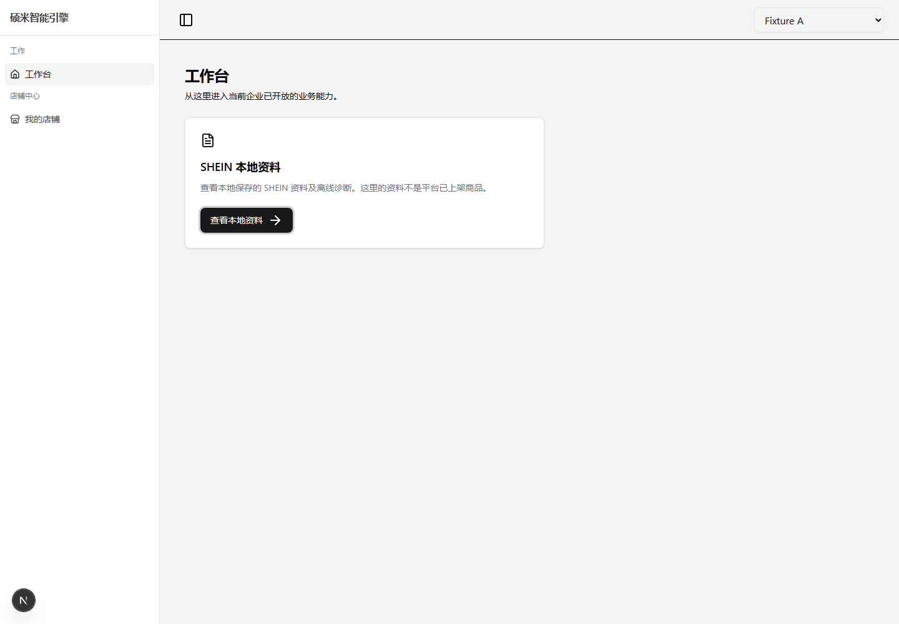
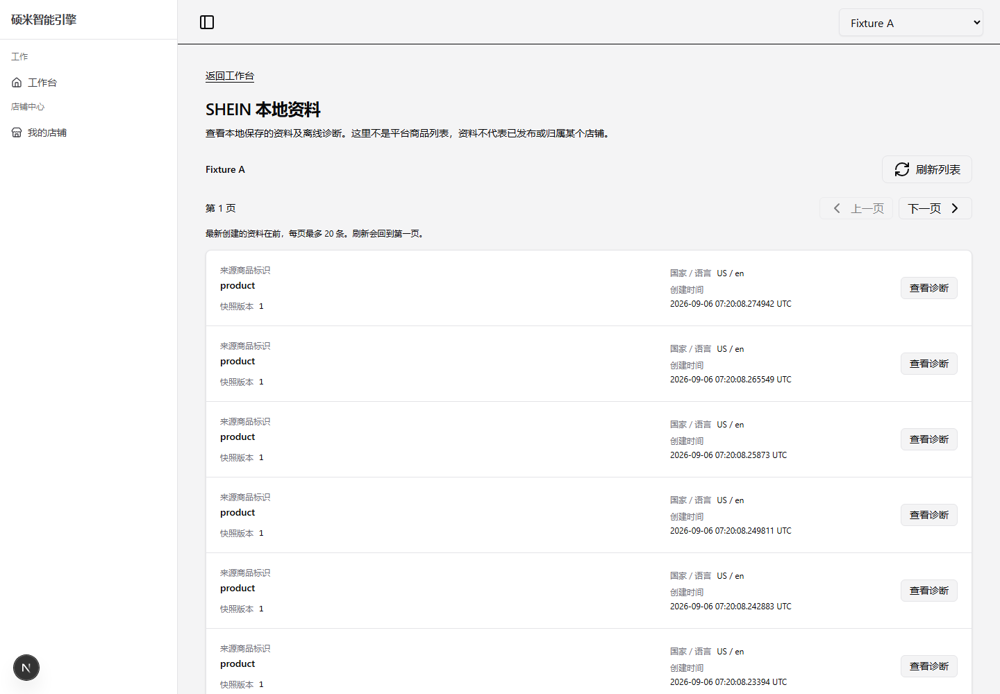
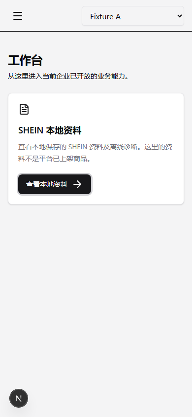
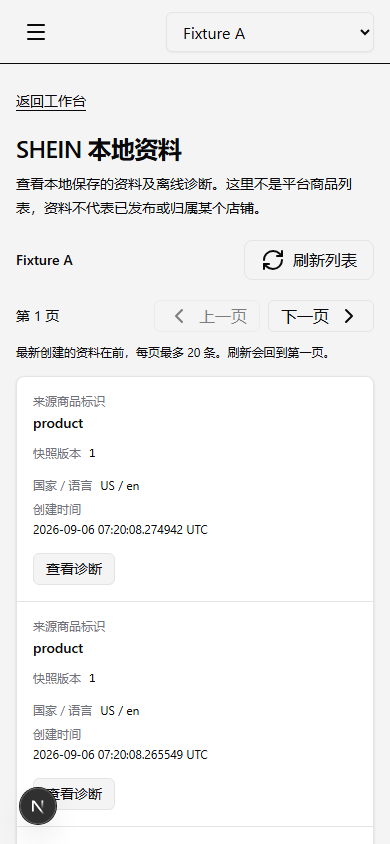

# SHEIN 本地资料入口与列表

Refs #328；集合合同、typed client、BFF 和跨进程 fixture 由 #327 维护。本页只展示当前企业和账号可读取的本地元数据，复用已有只读诊断。

## 体验路径

`/workbench` 的“SHEIN 本地资料”卡片 → “查看本地资料” → `/workbench/shein-records` → 选择实际列表行的“查看诊断” → “返回本地资料列表”。不要求用户输入或复制记录 UUID。

入口和列表的可用性由 Server Component 调用 #327 的 `isSheinRecordsAvailable()` 判断，只传布尔值给组件。请求时读取，未配置时明确“暂未启用”，不发送集合请求。该提示不替代服务端身份、企业和 Listing read 授权，也不意味着生产来源已经获准。

每行仅呈现服务端的来源商品标识、快照版本、国家/语言和创建时间；`snapshot_version` 从始至终作为字符串展示，不转换为 JavaScript Number。没有商品标题、图片、Store 归属、诊断摘要或发布状态的推断。列表不会逐行请求诊断，详情链接禁用预取；点击后仍由实际诊断 BFF 重新授权读取。

## 分页与隔离

- 每页20条，顺序与不透明游标由服务端决定。下一页/上一页都是新的读取；刷新回到首屏，新创建资料通过刷新发现。
- 仅保留最近50个分页位置，丢弃更早位置后明确提示刷新回首页，仍可继续向后浏览。不自动遍历集合、不读取total、不缓存历史报告、不持久化分页状态。
- 查询key包含user/org/roles作用域、分页输入及本次请求序号。企业/用户/角色变化、退出、确认撤权和卸载会销毁请求子树，取消请求并清空列表及游标。即使网络未能取消，旧响应也不能进入新作用域。
- 翻页和刷新期间隐藏旧数据，完成后焦点移到页码，便于键盘继续导航。失败与真实空集合分开，错误不回退空列表或旧数据。
- 企业/身份错误可使用已有context retry恢复；只在恢复成功且原身份/企业/角色未变时重新读首页，迟到恢复不重启已离开的请求。

## 受控浏览器启动、访问与停止

使用已包含 #327 与 #328 的工作区；安装 Go、Docker、Node 和锁文件要求的前端依赖。共享 fixture 的实现和资源边界见 [BFF fixture 说明](shein-diagnostic-bff-fixture.md)。

1. 仓库根启动共享隔离 fixture：

   ```powershell
   node web/listingkit-ui/scripts/shein-diagnostic-fixture.mjs --serve
   ```

2. 仅记录输出的 manifest 路径及本次 origin。资料由真实 Catalog Publisher + POST 创建，不能从 manifest 读取 recordId 当作列表导航来源。每次端口、记录及合成会话都不同。
3. 另一终端在 `web/listingkit-ui` 运行：

   ```powershell
   $env:ISSUE328_FIXTURE_MANIFEST = '填写本次 fixture.json 绝对路径'
   pnpm exec playwright test --config playwright.shein-records.config.ts --headed --debug
   ```

4. 在 Inspector 单步至 `<origin>/workbench`，由测试安装本次合成session，**点击工作台卡片**进入列表，再选择服务端返回的行查看诊断。可暂停后手动体验下一页、上一页、刷新，以及企业200→100→200。未安装该合成session的普通浏览器仍走既有登录流程；不复制或公开cookie。
5. 体验结束后停止调试测试，向本次manifest的controlDirectory写入空文件 `stop-fixture`。保留launcher运行直至它完成Go业务表内容/xmin未变化核对、正常退出并清理本次随机容器/schema。不要用终端强制结束进程树代替正常停止。旧地址不再是可访问入口，不清理其他数据库或容器。

浏览器验收从工作台开始，不直接goto诊断详情。检查真实分页、点击列表返回ID诊断、返回列表、跨企业空集合和重新读取、Store-only拒绝。截图由测试保存至仓库根 `.local/issue328-browser`，包含1440px/390px入口和列表；最终证据与实际运行结果留PR。

组件合同fixture及拦截HTTP的错误测试只证明界面行为；实际BFF/Go/隔离PostgreSQL的证据另列。合成产品与外部身份签发/Verifier/grants是明确替身，真实Publisher/POST、BFF、Go reader/evaluator/PG仍运行。真实ZITADEL、正式产品来源、生产启用未运行，不声明客户生产验收通过。

## 文件 owner 与验证

#328拥有工作台入口、列表组件/页面、诊断返回链接、UI/browser测试与本说明；#327独占集合schema/client、proxy、SQL/Go与共享fixture，双方不复制类型或互改代理。

UI验证：`pnpm test src/components/workbench/shein-records src/components/workbench/shein-diagnostic`；相关provider/Shell/Store回归及lint/typecheck/test/build由最终交付验证。实际浏览器配置独立于默认公共首页e2e，缺少fixture会明确失败，不能静默连接生产或使用mock fallback。

没有新增导航、登录、生成、编辑、发布、Apply或新Shell。未确认的体验改进只按“具体操作 → 观察结果 → 期望结果”记录，不在此片自动扩展。

## 浏览器截图

以下为真实 Next BFF → Go → 隔离 PostgreSQL 的受控合成数据截图；工作台点击、分页、诊断往返、企业切换和 Store-only 拒绝均由独立浏览器配置验证。截图不是正在运行的入口；请按上面的步骤启动本次环境。






完整列表截图：[1440px](evidence/issue328/list-1440.png)、[390px](evidence/issue328/list-390.png)。最终验证 SHA、CI 与独立评审结果在关联 PR 中维护。
