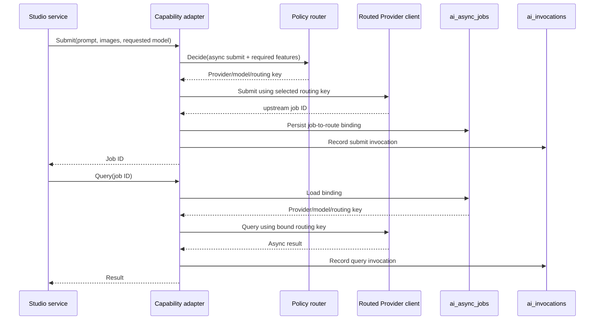

# AI Async Job Provider Binding Design

**Status:** Approved for implementation

**Goal:** Ensure an asynchronous Studio image job is queried through the same Provider and routing key that accepted its submission.

## Context

`listingkit.studio.image` now routes synchronous and asynchronous submissions through the provider-neutral capability router. The existing async query contract accepts only `jobID`, and the legacy routed image client resolves queries through its default model. This is safe only while one Provider owns all jobs; it is incorrect once active routing can submit jobs to multiple Providers.

## Recommended architecture

Add a dedicated `ai_async_jobs` persistence record and a provider-neutral route-aware query seam.

### Async job binding

The binding record stores operational routing metadata, not prompts, images, credentials, or response bodies:

- `job_id` (unique upstream job identifier)
- tenant, user, business task, and trace identifiers
- capability and submit operation
- Provider ID, model ID, routing key, and credential reference
- configuration and policy versions
- submitted, updated, and expiry timestamps
- status and last known error category

The binding is created only after a Provider returns a non-empty upstream job ID. Repeated writes for the same job ID are idempotent and must not silently replace a binding with a different Provider or routing key.

### Runtime behavior by mode

- `legacy`: preserve the existing submit and default query behavior; do not require the binding store.
- `shadow`: calculate and record route decisions as today, but preserve the existing submit and query paths; do not create a binding that changes behavior.
- `active`: submit through the selected routing key, persist the returned job binding, and query through the binding's route-aware Provider seam.

For an active query with no binding, retain compatibility for jobs created before this feature by using the legacy query path and recording an `unknown_remote_state` result. A binding-store failure must not cause a successful remote submission to be reported as a normal success without an observable error; the adapter records the failure and returns the Provider response only when the binding write is known to be durable or the caller receives an explicit unknown-state error.

### Provider-neutral query seam

The capability and ListingKit contracts must not import concrete Provider types. The existing routed image client will expose an optional route-aware async query interface that accepts a routing key and job ID. The adapter uses that interface in active mode and falls back to the existing query method only for legacy compatibility. Provider selection remains inside the existing ListingKit HTTP API client routing layer.

## Data flow

## Error and compatibility behavior

1. Empty upstream job IDs are treated as invalid Provider responses and are not persisted.
2. A duplicate job ID with matching route metadata is an idempotent success.
3. A duplicate job ID with conflicting route metadata is rejected and classified as an unknown remote state; it must not overwrite the original binding.
4. A missing binding for an active query uses the legacy query path only for backward compatibility and is recorded for alerting.
5. Provider query failures continue to be classified by the existing capability error categories.
6. Binding persistence is best-effort only in legacy/shadow; active mode makes the persistence outcome observable before returning a normal success.

## Schema and migration

`ai_async_jobs` is added to the existing ListingKit schema migration path. The table has a unique key on `job_id` and indexes for tenant/time, capability/time, and Provider/model. It contains only routing and lifecycle metadata. The existing `ai_invocations` ledger remains the immutable per-call audit record and is not used as the job-state store.

## Testing strategy

- Unit tests for idempotent insert, conflicting duplicate, missing binding, and expiry/status updates.
- Adapter tests proving active submit and query use the same routing key.
- Compatibility tests proving legacy and shadow query behavior is unchanged.
- Runtime migration test asserting `ai_async_jobs` exists after `scope=all` migration.
- Full Go test suite before merge; targeted tests must pass after each red-green cycle.

## Out of scope

- Agent orchestration or LangGraph integration.
- Tenant policy administration UI.
- Provider SDK rewrites.
- Prompt, image, or response persistence.
