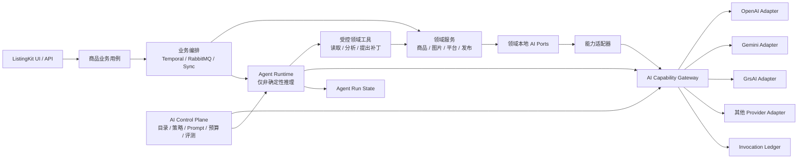

# AI Capability & Agent Platform 设计

## 1. 状态与决策

- 日期：2026-08-06
- 校准基线：`062b824f`
- 状态：方向已确认；Phase 1 已落地；Phase 2 ProductImage 场景生成治理与启用前身份上下文切片已实现，默认关闭，待独立发布与启用决策
- 核心决策：先在现有 Go 模块化单体内建立独立的 AI 能力治理边界，再用一个受控商品智能化场景验证 Agent 框架；当前不把全部 AI 拆成独立服务，也不让 Agent Runtime 接管现有业务工作流。

本设计区分三个问题：

1. 商品智能化处理：商品理解、内容生成、图片处理和平台适配仍由相应商品/资产/平台领域拥有。
2. AI Agent 编排：只负责确有动态工具选择、有限自修复和人工介入需要的非确定性推理。
3. 模型能力管理：集中管理模型能力、租户策略、凭据引用、路由、降级、调用记录、成本和健康状态。

第一份实施计划只覆盖第 14.1 节的“模型能力治理基础切片”。当前 Phase 2 采用 clean-slate 新能力入口：旧的未使用 ProductImage 场景路径不做 shadow、双写或兼容迁移。Agent PoC、其他调用点迁移和独立服务拆分分别作为后续独立计划，不在同一个实现批次中混做。

## 2. 背景

ListingKit 已经把 AI 用在商品理解、标题和描述生成、属性映射、图片分析、图片生成、图片编辑和质量审核等场景。当前代码并非没有抽象：

- `internal/productenrich` 有固定的解析、校验、分析、生成和结果校验流水线；
- `internal/productimage` 有细粒度的领域接口与固定图片处理阶段；
- `internal/prompt` 与 `internal/promptmgmt` 已支持文件模板、租户模板和版本字段；
- `internal/infra/clients/openai` 已提供文本、视觉、图片和异步图片任务的基础能力；
- Gemini Image、GrsAI 和 OpenAI 兼容接口已有独立适配器；
- RabbitMQ 负责既有简单后台任务，Temporal 已用于需要 durable execution 的业务长流程。

当前主要压力不是缺少更多流水线，而是模型能力和供应商概念已经横跨多个业务包：

- 多个业务模块直接引用 `internal/infra/clients/openai`；
- 名为 `openai` 的请求/响应类型已经被当作部分通用 AI 协议使用；
- provider 构建、模型选择和协议推断仍有一部分位于 HTTP/runtime 组装层；
- 当前租户模型设置主要描述 endpoint、model、API style 和 timeout，不能表达完整的能力与治理策略；
- token/usage 元数据存在，但没有统一、可查询的 AI 调用账本；
- 当前没有工具调用型 Agent Runtime，也没有必要把固定确定性流水线改写成 Agent。

仓库现有架构规则要求：模块边界稳定前保持模块化单体；外部客户端通过小接口暴露；ListingKit 保持编排与兼容 facade；Temporal、RabbitMQ 和同步调用各自承担合适的运行时职责。本设计延续这些规则，不创建第二套商品模型、平台规则、权限模型或业务状态机。

## 3. 目标

### 3.1 业务目标

- 让商品智能化能力能在不同模型和供应商之间演进，而不要求商品领域代码同步修改。
- 让租户可以按能力选择允许、首选和备选模型，同时受预算、权限和健康状态约束。
- 让每次 AI 调用可追踪到租户、业务能力、模型、Prompt 版本、耗时、用量、结果和错误分类。
- 用一个低风险、可评测的商品 Agent 场景证明动态编排是否产生真实收益。
- 为未来多个产品复用或独立部署 AI Runtime 保留稳定边界。

### 3.2 架构目标

- 业务包依赖自身定义的能力接口，不依赖具体供应商 SDK 或供应商 DTO。
- 模型治理规则只有一个 owner。
- 业务工作流状态、Agent 推理状态和商品事实分别只有一个 source of truth。
- 模型路由可以 shadow 运行和逐能力迁移，不需要大爆炸替换。
- 框架可替换：LangGraph、Eino、Google ADK Go 或后续框架都不能成为领域合同。

## 4. 非目标

- 不在第一阶段拆出独立 Python、Node.js 或 Go 微服务。
- 不迁移所有现有 OpenAI/GrsAI/Gemini 调用点。
- 不把 `canonical.Product`、平台草稿、平台规则或发布状态搬进 AI 模块。
- 不用 Agent 替换现有 `productenrich`、`productimage` 固定流水线。
- 不让 Agent 直接写业务数据库、直接调用平台发布接口或绕过人工审核。
- 不用 LangGraph 替换 Temporal，也不用 Temporal 表达模型内部推理循环。
- 不建立新的通用“万能 AI Client”供所有领域直接依赖。
- 不在本设计中决定最终独立服务语言；该决定由第 15 节的触发条件和 Agent PoC 证据驱动。

## 5. 设计原则

### 5.1 领域本地接口优先

每个领域继续定义最小能力接口，例如：

- 商品理解需要 `ProductAnalyzer`；
- SHEIN 属性处理需要 `AttributeInference`；
- 图片领域需要 `SceneGenerator`、`FaithfulEditor`、`ReviewAssessor`；
- Studio 需要同步/异步图片生成与编辑能力。

这些接口表达领域需要什么，不表达 OpenAI、Gemini 或 GrsAI 如何实现。领域包不直接依赖共享模型网关 DTO。由窄适配器把领域请求转换为模型能力调用。

### 5.2 控制面集中，领域规则分散到正确 owner

AI Control Plane 集中拥有通用治理：模型目录、租户策略、路由、预算、凭据引用、健康度和调用账本。

它不拥有：商品事实、SHEIN/TEMU/Amazon 规则、Prompt 中的业务含义、商品审核结论或发布决策。

### 5.3 确定性优先，Agent 只处理必要的不确定性

固定步骤、明确条件和可枚举校验继续使用普通 Go 服务或 Temporal Workflow。只有当执行路径需要根据模型判断动态选择工具、根据校验结果回退或请求人工输入时，才进入 Agent Runtime。

### 5.4 单一状态所有权

- 商品事实和平台草稿：领域数据库拥有。
- 商品处理、审核、发布与恢复阶段：现有任务模型和 Temporal/RabbitMQ 路径拥有。
- 单次 Agent 运行的中间推理状态：Agent Runtime 拥有。
- 模型调用审计、用量和成本：AI Invocation Ledger 拥有。

任何运行时都只能通过明确命令或结果合同更新另一个 owner 的状态。

### 5.5 默认安全和有界执行

Agent 工具使用 allowlist；写操作默认禁止；循环次数、总调用次数、总耗时和估算成本都有硬限制。供应商失败不得自动扩大权限或切换到不满足数据策略的模型。

## 6. 目标架构



依赖方向为：

```text
domain local port
  <- narrow capability adapter
  -> AI control plane/runtime contracts
  -> provider adapter
  -> provider SDK/API
```

`internal/app/*` 只组装这些实现，不包含模型选择或业务判断。

## 7. 组件边界

### 7.1 AI Model Catalog

模型目录记录可用于路由和治理的事实，不保存业务规则。建议字段：

- `provider_id`
- `model_id`
- `capabilities`：text、structured_output、vision、image_generate、image_edit、async_image_job、tool_calling
- `input_modalities` / `output_modalities`
- `supports_json_schema`
- `supports_tools`
- `supports_async`
- `region` / `data_policy_tags`
- `default_timeout`
- `max_concurrency`
- `input_unit_price` / `output_unit_price` / `image_unit_price`
- `enabled`
- `configuration_version`

目录只描述已配置且经过验证的能力，不根据模型名称字符串临时猜测能力。兼容期允许 adapter 内部识别旧配置，但路由器不把 URL 或模型名包含关系作为长期合同。

### 7.2 Tenant Model Policy

租户策略按 `tenant + capability` 生效，用户级覆盖仅保留当前已支持的明确场景。建议表达：

- 允许的 provider/model；
- 首选模型和有序 fallback；
- 最大单次估算成本；
- 最大运行时长；
- 数据区域和供应商限制；
- 是否允许跨 provider fallback；
- 凭据引用；
- 策略版本与启用状态。

API Key 仍由凭据存储负责。策略、日志、Agent 状态和业务请求不得复制明文密钥。

### 7.3 Capability Router

路由输入至少包含：

- tenant/user identity；
- capability；
- modality 和输入约束；
- 结构化输出或工具调用要求；
- 同步/异步要求；
- 延迟、质量和成本偏好；
- 显式模型选择器；
- idempotency key 与 trace context。

路由顺序：

1. 校验租户与数据策略；
2. 筛选满足能力约束且健康的模型；
3. 应用租户首选和显式选择；
4. 应用成本、并发和预算限制；
5. 形成包含原因与策略版本的 `RouteDecision`；
6. 调用 provider adapter；
7. 仅对允许的错误类型执行有限 fallback。

`RouteDecision` 必须可记录和回放。业务调用点不能自行再做第二层隐式模型切换。

### 7.4 Provider Adapters

Provider adapter 负责：

- 供应商请求/响应映射；
- SDK 或 HTTP 协议差异；
- provider request ID 和 job ID 提取；
- usage 归一化；
- provider 错误到统一错误类别的映射；
- 供应商级 timeout、限流和熔断；
- 对异步图片任务提供 submit/query/cancel 能力（供应商支持时）。

OpenAI、Gemini 和 GrsAI 的特有能力可以保留在 adapter 能力描述中，不能被一个过于宽泛的接口抹平。现有 `internal/infra/clients/*` 先作为实现复用，后续按仓库既定方向逐个迁入 `internal/integration/*`，不做一次性目录搬迁。

### 7.5 Prompt Management

复用现有 `internal/prompt` 与 `internal/promptmgmt`，不创建第二套 Prompt Store。增量目标是：

- 每次调用记录实际使用的 prompt key、scope、version 和内容摘要；
- Prompt 版本与离线评测集、评测结果关联；
- 支持草稿、验证、启用和回滚语义；
- 明确租户缺失时是否允许全局 fallback；
- Prompt 发布与模型策略发布分别版本化。

调用记录默认只保存内容哈希和必要元数据；是否保存完整 Prompt/响应由数据保留策略控制。

### 7.6 AI Invocation Ledger

每次模型尝试记录：

- `invocation_id`、`parent_invocation_id`、`agent_run_id`
- tenant/user、业务 task ID、capability
- provider、model、route decision 和 policy version
- prompt key/version/scope/hash
- started/finished、latency、attempt、fallback index
- token/image usage、估算成本和计费单位
- normalized outcome、error category、provider request/job ID
- input/output 引用或摘要，不默认复制敏感原文

账本用于审计、成本、运营和评测，不成为商品结果的第二份存储。

账本写入与模型副作用解耦：账本存储健康时，每次模型尝试都必须完整记录；写入失败时记录独立指标和告警，但不得因此自动重复模型调用。若后续审计要求需要跨故障保证完整性，应单独设计可靠投递机制，不能让 provider 调用与账本写入形成不可恢复的分布式事务。

### 7.7 Agent Runtime

Agent Runtime 负责：

- Agent 定义、版本和工具 allowlist；
- 单次运行的推理状态和 checkpoint；
- 工具调用、有限循环、人工 interrupt/resume；
- step、token、耗时和成本预算；
- Agent trace 与最终结构化结果。

Agent Runtime 不负责：

- 业务任务生命周期；
- 商品事实持久化；
- 平台发布；
- 租户授权来源；
- 跨业务流程 durable orchestration。

Agent 对外只返回结构化候选结果，例如 `ProposedProductPatch`、证据、置信度、未解决问题和建议审核动作。领域服务重新校验后才能应用。

## 8. 首个 Agent PoC

首个场景确定为“商品资料诊断与补全 Agent”，而不是自动上架 Agent。

### 8.1 输入

- 当前 canonical product 快照；
- 来源证据与图片引用；
- 目标平台和站点；
- 已知缺失项、当前 validation report；
- 租户允许的工具与模型策略。

### 8.2 可用工具

首版工具全部为只读或纯计算：

- 读取来源证据；
- 读取 canonical product；
- 视觉分析；
- 查询目标平台类目/属性规则；
- 调用现有确定性 validator；
- 生成候选文本或候选属性补丁。

首版不提供：保存草稿、修改价格、上传图片、登录店铺、保存平台草稿、正式发布或任意数据库写入工具。

### 8.3 推理图

```text
load_snapshot
  -> diagnose_gaps
  -> choose_tools
  -> collect_evidence
  -> propose_patch
  -> deterministic_validate
  -> repair_once_or_twice
  -> human_review_required
```

约束：

- 最多两次修复循环；
- 每个工具有独立 timeout；
- 超过 step、token、成本或时间预算立即停止；
- 结果必须包含证据和字段级置信度；
- validator 不通过时不能标记为可应用；
- 无论结果如何，首版都进入人工审核。

### 8.4 成功标准

与当前固定流程在同一离线样本集上比较：

- 必填事实补全率提高；
- 无证据推断率不高于基线；
- 平台 validator 通过率提高；
- 人工修改字段数下降；
- P95 延迟和单任务成本不超过预设预算；
- 所有工具调用、模型调用和停止原因可追踪；
- Agent 失败不影响原有固定流程继续使用。

## 9. 编排职责

### 9.1 同步 Go 服务

适合短时、确定性、无跨进程恢复需求的转换和校验。

### 9.2 RabbitMQ

继续承载已有简单后台任务、事件分发和稳定的 queue worker 路径。只有确实需要 workflow history 和 durable waiting 的路径才迁移。

### 9.3 Temporal

拥有跨进程业务长流程，例如任务生成层、人工审核等待、图片异步任务等待、平台提交、远端确认和失败恢复。Temporal activity 可以调用 Agent Runtime，但只把 Agent 视为一个有明确输入输出和幂等键的外部能力。

### 9.4 Agent Runtime

拥有一次推理运行内部的 node/edge、工具选择、有限修复循环和推理 checkpoint。Agent 完成后将结构化结果返回 Temporal 或调用方，不继续拥有业务生命周期。

禁止同一阶段同时由 Temporal 和 Agent Runtime 各自做重试。默认规则：

- Agent 内部只重试模型可恢复或工具瞬时失败；
- Agent run 级失败是否重跑由 Temporal/调用方决定；
- 所有有副作用的工具必须幂等，并由业务层分配 idempotency key；
- 首个 Agent PoC 没有副作用工具。

## 10. 错误与降级

统一错误类别至少包括：

- `invalid_input`
- `policy_denied`
- `capability_unavailable`
- `credential_unavailable`
- `rate_limited`
- `provider_timeout`
- `provider_unavailable`
- `provider_rejected`
- `invalid_provider_response`
- `structured_output_invalid`
- `budget_exceeded`
- `agent_step_limit_exceeded`
- `agent_tool_denied`
- `unknown_remote_state`

Fallback 规则：

- 只有策略明确允许且替代模型满足全部能力与数据约束时才能 fallback；
- 输入错误、权限拒绝、预算超限和内容策略拒绝默认不 fallback；
- 异步供应商返回未知远端状态时不得盲目重复 submit；
- 图片生成成功但后处理失败时保留原始资产并暴露阶段失败；
- Agent 输出校验失败时保留候选与诊断，但不应用到商品事实。

## 11. 多租户、安全与数据治理

- tenant/user identity 从已认证上下文传入，不接受 Agent 或模型自行声明。
- 模型策略、Prompt、调用记录和 Agent run 均带 tenant scope。
- 凭据只以引用形式进入路由决定，adapter 在调用时解析明文。
- 日志默认不输出 API Key、原始图片字节、完整 Prompt、完整模型响应或平台 cookie。
- Provider 必须声明数据区域和保留策略标签；租户策略可以禁止不符合要求的 provider。
- Agent tool schema 必须固定、最小权限，并在服务端重新授权。
- 模型生成的工具参数按不可信输入处理，经过 schema 和领域校验后才执行。

## 12. 可观测性、成本和评测

### 12.1 运行指标

- 调用量、成功率、错误类别和 fallback 率；
- provider/model/capability 维度的 P50/P95/P99 延迟；
- token、图片和异步 job 用量；
- 租户、能力和模型维度的估算成本；
- Agent 平均 step 数、工具调用数、人工中断率和预算终止率；
- Prompt/model/agent version 维度的质量指标。

### 12.2 离线评测

每个迁移能力建立固定样本集，至少覆盖：

- 正常输入；
- 缺失事实；
- 冲突证据；
- 多语言内容；
- 平台约束边界；
- provider 非法响应；
- 超时、限流和 fallback；
- Prompt 租户覆盖与全局 fallback。

评测结果必须与 `capability + model policy version + prompt version + agent version` 关联。仅凭单次人工体验不能发布新的默认路由或 Agent 版本。

## 13. 框架决策

### 13.1 第一阶段

不引入 Agent 框架。先完成领域接口、模型目录、租户策略、路由决定和调用账本，使框架无法反向污染领域合同。

### 13.2 Agent PoC 候选

PoC 使用同一输入、工具和结果合同比较：

1. Eino：Go 原生，适合复用现有 Go runtime、context、测试和部署方式。
2. Google ADK Go：官方 Go Agent SDK，适合验证 graph workflow、工具和 HITL；因当前版本较新，需要额外稳定性评估。
3. LangGraph：适合需要成熟图编排、checkpoint、HITL、LangSmith 和独立 AI 团队的 Python/TypeScript 服务。

选择评分维度：

- Go 领域工具集成成本；
- provider 可替换性；
- checkpoint 与幂等语义；
- HITL 和流式事件；
- tracing/evaluation；
- 自托管依赖和许可证；
- 故障恢复与升级兼容；
- 单次运行成本与资源占用。

PoC 不允许为了适配框架复制领域模型、业务数据库或 Temporal 状态。

## 14. 迁移阶段

### 14.1 Phase 1：模型能力治理基础切片

这是第一份实施计划的唯一范围：

1. 定义模型目录、能力、路由请求、路由决定、统一错误和调用记录模型；
2. 复用现有凭据 resolver，增加 capability 到现有 client 配置的映射；
3. 为一个 ListingKit Studio 图片能力建立窄适配器；
4. 以 shadow mode 记录新路由决定，但仍执行现有已验证 provider 路径；
5. 验证新旧路由决定一致后，通过开关切换该单一能力；
6. 增加依赖边界测试，禁止该切片新增具体 provider 类型泄漏；
7. 建立最小调用账本和脱敏日志。

本阶段不改变 Prompt、不改变图片生成请求语义、不调用真实付费模型做自动化测试。

### 14.2 Phase 2：逐能力迁移

按风险和收益逐个迁移，每个能力单独设计、测试和发布：

1. Studio 图片生成/编辑；
2. ProductImage 模型适配；
3. ProductEnrich 文本/视觉能力；
4. SHEIN 属性、类目和文案推理；
5. TEMU/Amazon 历史调用点。

每次只移一个 service-facing capability，不进行全仓目录搬迁。

### 14.3 Phase 3：商品资料诊断与补全 Agent PoC

在统一模型调用、账本和评测可用后，按第 8 节执行。Agent 运行通过 feature flag 和租户 allowlist 开启，固定流程始终可回退。

### 14.4 Phase 4：评估独立服务

只有满足第 15 节触发条件后，才设计网络 API、部署拓扑、服务级鉴权和数据保留方案。独立服务拆分本身需要新的设计文档。

## 15. 独立服务触发条件

满足以下多数条件后才建议从模块化单体拆成服务：

- 至少两个独立产品或 runtime 需要复用同一模型治理/Agent 能力；
- AI workload 需要与 API/业务 worker 独立扩缩容；
- AI 发布节奏和故障域需要与主 Go 服务隔离；
- provider、Prompt、评测和 Agent 合同已稳定经过至少两个迁移切片；
- 网络调用的延迟和可用性成本可以接受；
- 租户鉴权、凭据、数据驻留和审计跨服务方案已经验证；
- 团队愿意承担独立运行时、数据库、队列、监控和值班成本。

如果触发条件不满足，继续保持模块化单体不是临时妥协，而是正式架构选择。

## 16. 测试策略

### 16.1 合同测试

- 每个领域 port 对其 adapter 做合同测试；
- provider adapter 使用 mock HTTP 验证请求字段和响应映射；
- 不在默认测试中调用真实付费模型；
- 同步与异步图片路径分别覆盖；
- 路由决定测试覆盖租户、能力、健康、预算和 fallback。

### 16.2 边界测试

- 新增业务代码不得直接引入具体 provider SDK/DTO；
- `internal/app/*` 不拥有模型策略；
- Agent package 不依赖业务 repository 实现；
- 领域包不依赖 Agent 或 Temporal SDK；
- provider adapter 不依赖 ListingKit 或平台业务包。

### 16.3 可靠性测试

- provider timeout/rate limit/circuit open；
- async submit 成功但 query 未知状态；
- 路由记录写入失败不导致重复模型副作用；
- Agent checkpoint 后恢复不重复执行已完成的有副作用工具；
- 预算和 step limit 能确定性终止运行。

### 16.4 端到端验证

- 使用 fake provider 跑商品输入到候选结果、验证和人工审核路径；
- 对同一输入比较旧路径与新路由输出结构和元数据；
- 浏览器验证模型配置、调用明细和 Agent 审核状态；
- 真实 provider smoke 需要显式授权、受控租户和成本上限，不能作为默认 CI。

## 17. 验收标准

### 17.1 Phase 1

- 一个 Studio 图片能力可以通过新模型目录和路由层选择现有 provider；
- 切换前 shadow 路由与旧逻辑在测试样本上决策一致；
- provider 请求/响应合同不变；
- 账本存储健康时，每次调用记录 tenant、capability、provider、model、policy version、prompt metadata、耗时、usage 和 outcome；写入故障有指标与告警，且不触发重复模型调用；
- API Key、图片字节和完整敏感内容不进入普通日志；
- 原有路径可由 feature flag 立即恢复；
- 新增边界测试阻止新的具体 provider 类型泄漏；
- 相关 Go 测试、结构测试和 `git diff --check` 通过。

### 17.2 Agent PoC

- 只使用 allowlist 中的只读/纯计算工具；
- 最多两次修复循环且预算限制有效；
- 输出是结构化候选补丁，不直接修改商品；
- 所有字段建议都有证据或明确标记为无证据推断；
- 离线样本集上至少一项核心质量指标优于固定流程，且其他安全指标不退化；
- 固定流程在 Agent 关闭或失败时保持可用。

## 18. 风险与缓解

### 18.1 过度中心化

风险：形成所有领域共同依赖的庞大 AI 抽象。

缓解：领域本地接口保持最小；共享层只拥有模型治理和 provider-neutral runtime 数据；每次只迁移一个 capability。

### 18.2 两套编排状态

风险：Temporal 和 Agent Runtime 同时拥有业务阶段、重试和人工等待。

缓解：Temporal 拥有业务 run；Agent 只拥有推理 run；二者通过单个 activity/request-result 合同交互。

### 18.3 静默质量退化

风险：模型 fallback 成功返回，但输出质量或平台合规性下降。

缓解：fallback 结果仍执行领域 validator；记录 route/fallback；默认需要评测门禁，不能只看 HTTP 成功率。

### 18.4 成本失控

风险：Agent 循环、并行工具或高价图片模型扩大成本。

缓解：租户策略、预估成本、step/token/time 上限、并发限制和调用账本共同约束。

### 18.5 多技术栈运维负担

风险：过早采用 LangGraph 服务增加 Python/Node、数据库、队列和部署负担。

缓解：第一阶段保持 Go 单体；只有复用和扩缩容证据达到触发条件后再拆服务。

## 19. 回滚策略

- 所有迁移按 capability feature flag 切换；
- 新路由先 shadow，不影响真实执行；
- 新调用账本是旁路审计，不成为完成业务事务的前置条件；
- 切换后保留旧 adapter 路径一个稳定观察窗口；
- Agent PoC 仅对 allowlist 租户开启，失败时回到固定流程；
- 不通过删除旧数据、重写商品模型或双写第二份商品状态实现迁移。

## 20. 参考

- `docs/architecture/project-boundaries.md`
- `docs/architecture/external-client-boundary-inventory.md`
- `docs/architecture/temporal-boundaries.md`
- `docs/architecture/temporal-workflow-evaluation.md`
- `internal/productenrich/pipeline.go`
- `internal/productimage/pipeline.go`
- `internal/productimage/providers/interfaces.go`
- `internal/listingkit/ai_contracts.go`
- `internal/listingkit/httpapi/ai_client_builders.go`
- `internal/prompt/registry.go`
- [LangGraph overview](https://docs.langchain.com/oss/javascript/langgraph/overview)
- [LangGraph Agent Server](https://docs.langchain.com/langsmith/agent-server)
- [CloudWeGo Eino](https://github.com/cloudwego/eino)
- [Google ADK Go](https://adk.dev/get-started/go/)
