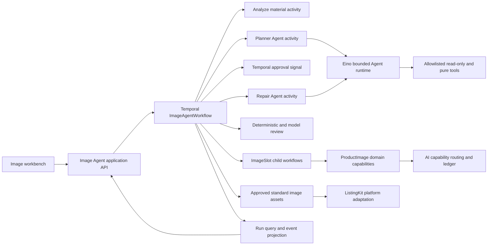

# Image Agent Workflow Design

## 1. Status and decision

- Date: 2026-08-26
- Baseline: `1d7a6f3d5`
- Status: design approved in chat; implementation has not started
- Scope: phase one builds an image-generation-specific Agent workflow only
- Default interaction mode: Agent-assisted
- Durable workflow engine: the repository's existing Temporal runtime
- Agent reasoning runtime: CloudWeGo Eino behind repository-owned ports

The selected design provides a complete image Agent experience without creating a second durable workflow engine. Temporal owns cross-process execution, waiting, recovery, retries, and business lifecycle. Eino owns bounded, non-deterministic reasoning inside planner and repair activities. Existing `productimage` and `aicapability` modules remain the owners of image operations and governed model invocation.

## 2. Context and root cause

The current ProductImage pipeline ranks accepted source images into one primary source and multiple scene candidates, but the normal gallery path calls the configured scene renderer once using the primary subject. The local renderer also returns one scene asset per call. Consequently, a product with nine usable 1688 images can still produce one generated gallery image.

This is not fundamentally a frontend source-image visibility issue and it is not an output-count limit issue. The missing abstraction is an explicit generation plan containing independently executable image targets. Treating one gallery stage invocation as the whole gallery makes source selection, output count, retries, quality review, and user control inseparable.

The new workflow must also address an existing product gap: when a long-running task pauses or fails, the workbench must show the exact node or image slot, the reason, whether the system will retry, and what the user can do next.

## 3. Goals

- Let users choose manual, Agent-assisted, or Agent-automatic image generation.
- Make Agent-assisted mode the default.
- Let users choose a reference style while preserving product identity.
- Plan outputs by image role and slot instead of by one gallery call or one output per source image.
- Execute and recover each target image independently.
- Let the Agent inspect evidence, choose tools, propose plans, evaluate failures, and repair rejected slots within explicit limits.
- Support durable human approval and manual takeover.
- Surface complete run, node, slot, budget, retry, and blocking state to the workbench.
- Reuse Temporal, ProductImage, AI capability governance, prompt management, invocation ledger, and asset lifecycle infrastructure.
- Preserve all approved standard image assets without a global ten-image cap.

## 4. Non-goals

- Do not extend phase one to title, description, attribute, translation, pricing, listing submission, or publication Agents.
- Do not let the Agent publish a marketplace listing or mutate canonical product facts.
- Do not replace `productimage`, `aicapability`, prompt management, the invocation ledger, or asset storage.
- Do not merge this workflow with `localagent`; that module remains the 1688 device-side acquisition protocol.
- Do not make a provider SDK, Eino type, or Temporal type part of a domain or public HTTP contract.
- Do not silently fall back from generated images to source images or local canvas output.
- Do not infer the required number of outputs from the number of source images.
- Do not build a generic multi-domain Agent platform in phase one.

## 5. Relationship to existing architecture

This design refines, rather than replaces, the existing AI capability and ProductImage designs.

The ownership rules are:

- Temporal owns the durable image workflow run, business phases, approval waits, cancellation, recovery, and run-level retry decisions.
- Eino owns one bounded planner or repair reasoning run, its read-only/pure tool selection, and its structured result.
- `imageagent` owns the image-plan domain model, run projection, mode policy, plan validation, and commands sent across owner boundaries.
- `productimage` owns image inspection, faithful edits, scene generation, review, validation, publishing, and asset lifecycle.
- `aicapability` owns model routing, credentials, policy, cost accounting, normalized AI errors, and invocation records.
- ListingKit owns consumption of approved standard image assets and later platform adaptation.
- Canonical product and source modules own product facts and 1688 source lineage.

Temporal must not express the model's internal tool-selection loop. Eino must not own cross-process approval waits or business recovery. A Temporal activity invokes Eino through a request/result port, and the result is validated before the workflow acts on it.

Eino is selected because it is an Apache-2.0 Go Agent framework with tool calling, graph composition, callbacks, and interrupt/resume primitives. Phase one uses its Agent and tool abstractions for bounded reasoning, but retains Temporal as the sole durable workflow owner. The repository must not implement a competing custom graph or checkpoint engine.

## 6. High-level architecture



### 6.1 New module boundary

Add `internal/imageagent` with focused subpackages:

- domain models and validation
- application commands and queries
- repository ports and persistence adapters
- Eino planner/repair adapter
- ProductImage tool adapters
- Temporal contracts, workflows, activities, and worker registration
- HTTP handlers and workbench projections

The domain package cannot import Eino, Temporal, provider SDKs, ListingKit platform packages, or HTTP types. Composition belongs in the existing application/runtime assembly layer.

### 6.2 Agent tools

The reasoning Agent receives only allowlisted, server-defined tools:

- inspect product context and source-image evidence
- inspect existing image assets and their lineage
- list tenant-authorized built-in, uploaded, and saved style references
- inspect marketplace-neutral image-role guidance
- validate a proposed generation plan
- inspect slot evaluation evidence
- simulate the budget effect of a proposed repair

These tools are read-only or pure calculation. Image generation, asset publication, database mutation, and listing publication are not Eino tools. The Agent returns a structured plan or repair command; Temporal invokes the corresponding idempotent domain activity.

## 7. Interaction modes

All modes use the same `ImageGenerationPlan`, slot executor, evaluator, assets, and run projection.

### 7.1 Manual

- The user creates or edits the plan directly.
- The workflow skips Agent planning.
- Deterministic plan validation remains mandatory.
- The user can regenerate or replace individual slots.

### 7.2 Agent-assisted

- This is the default mode.
- The Agent proposes a versioned plan.
- The workflow waits for plan approval before creating generation side effects.
- After execution and repair, the workflow waits for final result approval.

### 7.3 Agent-automatic

- The Agent may plan, generate, evaluate, and repair without plan approval while every action remains inside tenant policy and run budget.
- Policy can require final result approval; otherwise the workflow may approve image assets automatically.
- Automatic approval only publishes image assets. It never publishes a marketplace listing.
- Any policy, identity, authenticity, IP, content-safety, budget, or unknown-remote-state boundary pauses the run for a human.

Users may switch from assisted or automatic mode to manual mode at any non-terminal point. The workflow preserves completed slots and continues from an explicitly revised plan; it does not restart the whole run.

## 8. Style and product-identity contract

### 8.1 Separate semantic roles

- Product source assets define what the product is.
- Style references define how the product is presented.
- Generated candidates are new assets and never become source evidence retroactively.

Style references may affect background, lighting, composition, atmosphere, props, palette direction, and visual language. They may not change product shape, colorway, material, structure, logo, functional details, included components, or variant identity.

### 8.2 Style reference sources

Normalize all supported sources into `StyleReference`:

- built-in style catalog
- user-uploaded reference assets
- a previously approved generated result saved as a reusable style

An automatic Agent may select only references authorized for the current tenant. It cannot scrape or import arbitrary network images.

The plan has one product-level style reference set and allows a slot-level override. For example, the product can use a modern-home style while the main-image slot overrides it with a pure-white presentation.

If a provider has an input-reference limit, the Agent or deterministic adapter selects a declared subset for that invocation and records the selection. The limit is an invocation constraint, not a limit on stored references or generated outputs.

### 8.3 Authenticity enforcement

Every candidate passes model-backed identity review plus deterministic guards. A suspected product-identity change rejects the candidate and records reason codes. The repair Agent may reduce style influence, change the source asset, or change composition, but may not weaken the identity rule.

## 9. Generation plan and state model

### 9.1 ImageAgentRun

`ImageAgentRun` is the durable application aggregate and contains:

- run ID, business task ID, tenant ID, user ID, and trace ID
- mode and current status
- current workflow node
- active plan revision
- policy, prompt, and Agent definition versions
- call, image, cost, step, repair, and elapsed-time budgets
- accumulated usage
- blocking reason and available actions
- created, updated, started, and finished timestamps

Run states are:

- `planning`
- `awaiting_plan_approval`
- `executing`
- `evaluating`
- `repairing`
- `awaiting_final_approval`
- `blocked`
- `completed`
- `failed`
- `cancelled`

`blocked` is not a generic failure. It identifies a condition that requires a user or operator action and exposes the permitted commands.

### 9.2 ImageGenerationPlan

A plan is immutable after creation and includes:

- revision and parent revision
- product source asset references
- product-level style references
- target image slots
- identity, content-safety, IP, and marketplace-neutral constraints
- execution and repair budget
- creator type: user or Agent
- structured decision summary and evidence references

User edits and Agent replanning create new revisions. Approvals bind to an exact revision and become invalid when a newer revision is activated.

### 9.3 ImageSlot

Each `ImageSlot` represents one target output:

- stable slot ID and role
- source asset references
- optional slot-level style override
- scene brief, composition, and constraints
- idempotency key
- status and attempt counters
- generated candidates
- selected candidate
- quality, identity, duplicate, IP, and rule-validation results
- failure or rejection reason

Supported phase-one roles are:

- main image
- scene image
- detail image
- selling-point image
- size image

The initial role template is one main image, three to five scene images, two to four detail or selling-point images, and one size image when reliable dimension data exists. The Agent may propose a different composition when evidence and policy support it, and the user may override it.

### 9.4 Supporting records

- `AgentDecision`: structured decision, evidence references, confidence, unresolved issues, tool calls, and stop reason; hidden chain-of-thought is not stored.
- `Approval`: run ID, plan revision, actor, action, comment, and timestamp.
- `AssetCandidate`: source/style lineage, provider invocation references, prompt lineage, quality evidence, and acceptance state.
- `StepAttempt`: node/slot, attempt, input/output hashes, timestamps, outcome, normalized error, and cost.

## 10. Durable workflow

### 10.1 Parent workflow

`ImageAgentWorkflow` executes:

```text
load_material
  -> analyze_material
  -> plan_or_accept_manual_plan
  -> deterministic_plan_validation
  -> optional_plan_approval
  -> execute_slots
  -> evaluate_candidates
  -> repair_failed_slots_within_budget
  -> optional_final_approval
  -> publish_approved_assets
  -> complete
```

Temporal Queries expose the complete run projection. Signals carry mode changes, plan approval, final approval, cancellation, plan replacement, and slot actions. Signals are idempotent and include the expected run/plan revision.

### 10.2 Slot child workflow

Each target slot runs as an `ImageSlotWorkflow`. Slots execute in parallel under a configured concurrency limit. A slot workflow:

1. claims its slot idempotently;
2. invokes the appropriate ProductImage capability;
3. reconciles asynchronous or unknown remote state;
4. persists candidate lineage;
5. runs required candidate checks;
6. returns a typed result to the parent.

Failure of one slot does not discard successful siblings. Semantic repair creates a new attempt for only the rejected slot. It never reruns the entire image set.

### 10.3 Planner and repair Agents

The planner and repair activities invoke Eino through repository-owned ports:

- `PlanImages(context, PlanningInput) (PlanningResult, error)`
- `PlanSlotRepair(context, RepairInput) (RepairResult, error)`

Both results use strict schemas and pass deterministic validation before the workflow acts. Eino may use only the approved read-only and pure tools. A bounded Agent run stops on success, tool denial, invalid structured output, step limit, cost limit, or timeout.

Generation side effects occur only after the Agent result is accepted by the deterministic application layer. This separates non-deterministic decisions from replayable durable execution.

## 11. Candidate evaluation and repair

Every candidate is evaluated for:

- product identity preservation
- role-specific composition and clarity
- resolution and format
- marketplace-neutral commerce suitability
- style adherence without source copying
- duplicate and near-duplicate similarity
- IP, logo, watermark, unsafe-content, and overlay risks
- source, prompt, model, and output lineage completeness

The evaluator emits reason codes and repair hints. Exact duplicates and near-duplicates cannot occupy separate accepted slots unless the plan explicitly requires variant-equivalent outputs and policy permits it.

The repair Agent can:

- choose a different approved source asset
- choose another authorized style reference
- reduce or remove style influence
- change scene, props, lighting, or composition
- request a faithful-edit path instead of generative composition
- recommend manual intervention

It cannot relax hard identity, authorization, budget, IP, or content-safety rules.

## 12. Workbench design

The image workbench has three coordinated areas:

- Material panel: product source images and style references are visibly separate.
- Plan board: slots are grouped by role and expose source, style, brief, candidate, status, and actions.
- Agent panel: current node, decision summary, budget, attempts, blockers, and requested user action.

Every slot card shows:

- selected product source and style reference
- current state and progress
- generated candidates
- quality and authenticity results
- exact failure or rejection reason
- cost already incurred
- retry expectation
- actions to regenerate, change source/style/brief, accept, or discard

The run header shows current mode, current node, completed/total slots, whether user input is required, next retry time, accumulated cost, and last state change. The UI must never represent a blocked workflow only as `processing`.

## 13. Application API

The HTTP API exposes application commands and projections, not Temporal SDK details:

- create an image Agent run
- get a complete run projection
- subscribe to run events using SSE
- create a new plan revision with optimistic concurrency
- approve or reject an exact plan revision
- approve or reject final results
- switch mode
- cancel a run
- issue a slot-level retry, replace-source, replace-style, edit-brief, accept, or discard command

The application service translates commands into Temporal starts or Signals and reads Temporal Queries plus durable projections. SSE is an optimization for live updates; reconnecting clients recover from the complete query snapshot and an event cursor.

## 14. Error, retry, and idempotency policy

Errors are normalized using the existing AI capability categories and mapped into:

- retryable technical failure
- non-retryable policy or input failure
- human-action-required block
- unknown remote state requiring reconciliation

Rules:

- Temporal activity retry handles transient technical execution failures.
- Eino's bounded loop handles recoverable reasoning/tool failures inside one Agent run.
- Semantic candidate repair is owned by the parent image workflow.
- The same failure cannot be retried independently by more than one owner.
- Invalid input, policy denial, missing credential, authenticity rejection, tool denial, and budget exhaustion do not fall back automatically.
- A timeout after remote submission enters reconciliation; it is not blindly resubmitted.
- Run, plan revision, slot, attempt, model invocation, and asset publication each have stable idempotency keys.
- Cancellation stops new slot work. Submitted remote work is reconciled and accounted for before terminal state.
- Every automatic loop has hard step, attempt, elapsed-time, image-count, and estimated-cost limits.

When limits or human-only conditions are reached, the run enters `blocked` with a reason, incurred cost, and allowlisted next actions.

## 15. Security and tenancy

- Authenticated tenant and user identity are captured when the run is created and restored for every worker activity.
- Asset, style, plan, run, and approval access is tenant-scoped and reauthorized server-side.
- Product text, 1688 content, user text, image metadata, and model tool arguments are untrusted inputs.
- The Agent cannot declare identity, expand its tool allowlist, choose unapproved providers, or request arbitrary network/database access.
- Credentials remain references resolved only in provider adapters.
- Logs and Agent state do not store secrets, cookies, raw image bytes, full hidden reasoning, or unrestricted provider payloads.
- Prompt, Agent, policy, model route, and tool schema versions are recorded.
- Approval is rejected when actor authorization or expected plan revision does not match.

## 16. Image count and platform adaptation

Neither the image Agent workflow nor the standard product layer imposes a global maximum of ten images. The workflow may generate and preserve any policy-approved number of standard image assets.

If a target marketplace or API operation has a submission limit, platform adaptation selects and orders the applicable subset for that operation. It must not delete standard assets, reject the standard product merely because it has more than ten images, or reinterpret unsubmitted assets as failures.

Provider request limits, style-reference limits, concurrency limits, and marketplace submission limits are distinct contracts and must not be collapsed into a single image-count boundary.

## 17. Observability and audit

The run projection and metrics include:

- run and slot status counts
- node and slot latency
- plan revisions and approval wait time
- Agent steps, tool calls, stop reasons, and confidence
- model/provider/prompt/Agent/policy versions
- generated, accepted, rejected, duplicate, and repaired image counts
- retries by owner and normalized error category
- estimated and final image-generation cost
- automatic-to-manual takeover rate
- authenticity and policy rejection rates

Every AI invocation uses the existing invocation ledger and carries `agent_run_id`, business task ID, trace ID, parent invocation ID, prompt lineage, provider request/job ID, usage, cost, and output hash. The ledger remains audit evidence, not a second asset or workflow store.

## 18. Compatibility and rollout

The existing ProductImage entry point remains available while the new path is introduced behind an explicit capability and tenant allowlist. There is no silent fallback in either direction.

Delivery is split into independently verifiable slices while preserving the complete target architecture:

1. Domain models, persistence, Temporal contracts, run projection, and deterministic fake tools.
2. Manual mode with real multi-slot execution, recovery, and workbench status.
3. Eino planner Agent, Agent-assisted mode, versioned plan approval, and style selection.
4. Candidate evaluation, duplicate detection, slot repair Agent, and budget governance.
5. Tenant-canary Agent-automatic mode, followed by measured expansion.

Each slice keeps old production behavior available through an explicit route decision. A failed new-path run is visible and recoverable; it is never reported as a successful old-path result.

## 19. Testing strategy

### 19.1 Domain and application tests

- state-transition table for every run and slot state
- immutable plan revisions and stale-approval rejection
- manual, assisted, and automatic mode policies
- style/source role separation
- budget, step, repair, and elapsed-time guards
- tenant ownership and authorization
- allowed commands for each blocked reason

### 19.2 Agent tests

- strict planner and repair result schemas
- allowlisted tool enforcement
- invalid tool arguments treated as untrusted input
- deterministic validator rejection of unsafe Agent output
- step, tool, timeout, and budget termination
- fixture-based plan quality and repair quality evaluation
- no hidden reasoning persisted

### 19.3 Temporal tests

- workflow replay determinism
- duplicate and out-of-order Signals
- approval waits and cancellation
- worker restart and activity retry
- child-slot partial failure and recovery
- unknown remote state reconciliation
- idempotent asset publication
- no duplicate generation after workflow replay

### 19.4 Integration and browser tests

- source/style selection and plan editing
- complete state and blocker rendering
- SSE disconnect and snapshot recovery
- manual takeover from an automatic or assisted run
- slot-level retry without sibling loss
- final approved assets consumed by ListingKit
- target-platform selection does not delete excess standard assets

## 20. Acceptance criteria

The first production-capable assisted flow is accepted only when all of the following hold:

1. A 1688 product with nine usable source images can produce a validated plan containing one main, four scene, and two detail slots.
2. The workflow executes seven independent slot identities and does not treat one scene-renderer response as the complete gallery.
3. One failed slot can be repaired without regenerating or losing successful siblings.
4. Duplicate candidates are rejected and the missing slot is repaired or explicitly blocked.
5. A style-induced product color, structure, material, logo, or detail change is rejected.
6. A remote timeout with unknown state is reconciled before any resubmission.
7. A stale plan approval cannot start generation.
8. Switching to manual mode preserves completed slots and resumes from a selected failed slot.
9. The workbench exposes current node, slot progress, blocking reason, incurred cost, retry behavior, and available action.
10. Cross-tenant source, style, candidate, run, and approval access is denied.
11. More than ten approved standard image assets can be stored and reviewed; a platform limit affects only that platform's selected submission subset.
12. Existing ProductImage behavior remains separately routable and no silent source-image or local-canvas success fallback is introduced.

## 21. Risks and mitigations

- Two workflow owners: Temporal owns durable business state; Eino owns only bounded reasoning state behind one activity contract.
- Excess cost from repair loops: hard per-run and per-slot budgets, preflight estimation, and automatic blocking.
- Product identity drift: separate source/style semantics, model review, hard guards, and non-relaxable rejection rules.
- Duplicate outputs: perceptual duplicate evaluation before acceptance and slot-level repair.
- Framework leakage: repository-owned planner, repair, tool, and result ports isolate Eino types.
- Large migration blast radius: capability flag, tenant allowlist, explicit route, and incremental vertical slices.
- Stuck invisible tasks: durable blocked states, complete query projection, event cursor, and explicit next actions.

## 22. References

- Existing AI capability and Agent platform design: `docs/superpowers/specs/2026-08-06-ai-capability-agent-platform-design.md`
- Existing model-driven ProductImage design: `docs/superpowers/specs/2026-04-19-model-driven-productimage-design.md`
- Existing hot-style reference design: `docs/superpowers/specs/2026-07-02-listingkit-hot-style-reference-design.md`
- Existing ProductImage usage lifecycle design: `docs/superpowers/specs/2026-08-22-listingkit-product-image-usage-lifecycle-design.md`
- CloudWeGo Eino: https://github.com/cloudwego/eino
