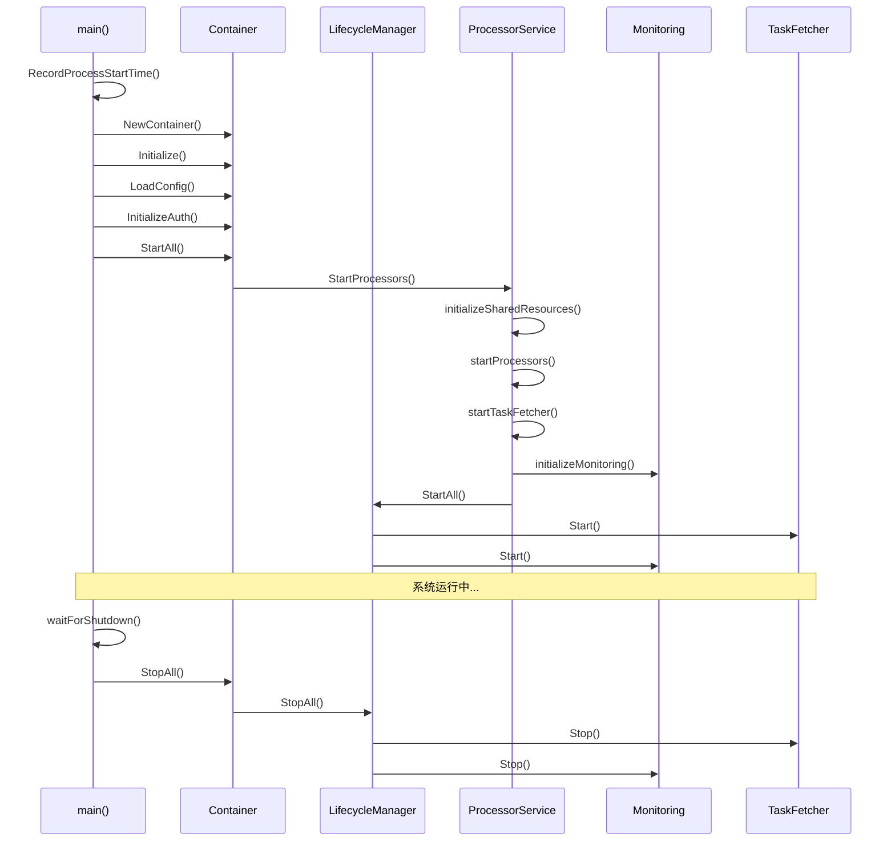

# 多平台任务处理系统 - 架构文档 (改进版)

## 📋 项目概述

这是一个**企业级多平台电商任务处理系统**，支持 TEMU、SHEIN、Amazon 等电商平台的产品爬取、数据转换和自动发布。系统采用 Go 语言开发，经过架构重构后具备更强的健壮性、可维护性和可扩展性。

### 核心功能
- 🔄 **多平台支持**: TEMU、SHEIN、Amazon 等电商平台
- 🚀 **高并发处理**: 基于 WorkerPool 的并发任务处理
- 🔐 **安全认证**: OAuth2 客户端凭证模式认证
- 📊 **智能路由**: 基于店铺信息的自动任务分发
- 🛡️ **容错机制**: 完整的重试、降级和错误处理
- 🔧 **自动运维**: 自动更新、状态监控、优雅关闭
- 📈 **监控可观测**: 指标收集、健康检查、结构化日志
- 🏗️ **架构优化**: 依赖注入、生命周期管理、统一错误处理

---

## 🏗️ 改进后的系统架构

### 整体架构图

```
┌─────────────────────────────────────────────────────────────┐
│                    cmd/task/main.go                         │
│         (程序入口 - 依赖注入容器 & 生命周期管理)             │
└────────────────────┬────────────────────────────────────────┘
                     │
        ┌────────────▼────────────┐
        │   Container (DI容器)    │
        │ - 统一资源管理          │
        │ - 共享实例管理          │
        │ - 生命周期协调          │
        └────────────┬────────────┘
                     │
        ┌────────────▼────────────┐
        │ LifecycleManager        │
        │ - 组件启停管理          │
        │ - 优雅关闭协调          │
        │ - 错误回滚机制          │
        └────────────┬────────────┘
                     │
    ┌────────────────┼────────────────┐
    │                │                │
    ▼                ▼                ▼
┌─────────┐    ┌──────────────┐  ┌──────────────┐
│ Config  │    │ Monitoring   │  │ Error        │
│ Service │    │ - Metrics    │  │ Handling     │
│         │    │ - Health     │  │ - 统一错误   │
└─────────┘    │ - Logging    │  │ - 错误链     │
               └──────────────┘  └──────────────┘
                     │
        ┌────────────▼────────────┐
        │ ProcessorService        │
        │ (核心服务编排)          │
        │ - 平台处理器管理        │
        │ - 任务获取协调          │
        │ - 监控集成              │
        └────────────┬────────────┘
                     │
    ┌────────────────┼────────────────┐
    │                │                │
    ▼                ▼                ▼
┌──────────────┐ ┌─────────────┐ ┌─────────────┐
│ TaskFetcher  │ │ Platform    │ │ Shared      │
│ - 统一获取   │ │ Processors  │ │ Resources   │
│ - 智能分发   │ │ - TEMU      │ │ - Amazon    │
│ - 去重管理   │ │ - SHEIN     │ │ - Management│
│ - 生命周期   │ │ - 适配器    │ │ - 单例管理  │
└──────────────┘ └─────────────┘ └─────────────┘
```

### 核心组件关系图

```
TaskFetcher (统一任务获取)
    ├─ DeduplicationManager (去重管理)
    ├─ TaskSubmitterAdapter (平台适配器)
    │   ├─ TemuProcessor
    │   └─ SheinProcessor
    └─ CleanupService & MonitorService

Platform Processors (平台处理器)
    ├─ TemuProcessor
    │   ├─ BaseProcessor (基础功能)
    │   ├─ WorkerPool (并发处理)
    │   └─ SharedAmazonProcessor (共享资源)
    └─ SheinProcessor
        ├─ BaseProcessor (基础功能)
        ├─ WorkerPool (并发处理)
        └─ SharedAmazonProcessor (共享资源)

Monitoring System (监控系统)
    ├─ MetricsCollector (指标收集)
    │   ├─ SystemMetrics (系统指标)
    │   ├─ BusinessMetrics (业务指标)
    │   └─ ProcessMetrics (进程指标)
    └─ HealthChecker (健康检查)
        ├─ ConfigHealthCheck
        ├─ ManagementClientHealthCheck
        └─ ProcessorHealthCheck
```

---

## 🔄 程序启动流程

### 启动时序图



### 详细启动步骤

#### 1. 程序入口初始化
```go
func main() {
    // 记录进程启动时间 (用于监控)
    monitoring.RecordProcessStartTime()
    
    // 设置日志系统
    logger := utils.SetupLogger()
    
    // 创建依赖注入容器
    container := container.NewContainer(logger)
    
    // 运行应用
    runApplication(container)
}
```

#### 2. 容器初始化和启动
```go
func runApplication(container *container.Container) error {
    // 初始化容器
    container.Initialize()
    
    // 加载配置
    container.LoadConfig("")
    
    // 初始化认证
    container.InitializeAuth()
    
    // 启动所有组件
    container.StartAll(ctx)
    
    // 等待关闭信号
    waitForShutdown()
    
    // 优雅关闭
    return gracefulShutdown(container)
}
```

---

## 🎯 核心架构改进

### 1. 依赖注入容器 (Container)

**文件**: `internal/container/container.go`

**职责**:
- 统一管理所有服务实例
- 管理共享资源的生命周期
- 提供线程安全的资源获取

**核心方法**:
```go
type Container struct {
    logger                *logrus.Logger
    config                *config.Config
    lifecycleManager      *lifecycle.Manager
    
    // 服务实例
    configService         *service.ConfigService
    authService           *service.AuthService
    processorService      service.ProcessorService
    
    // 共享资源
    amazonProcessor       *amazon.AmazonProcessor
    managementClient      *management.ClientManager
}

func (c *Container) GetSharedAmazonProcessor() (*amazon.AmazonProcessor, error)
func (c *Container) GetSharedManagementClient() (*management.ClientManager, error)
func (c *Container) StartAll(ctx context.Context) error
func (c *Container) StopAll(ctx context.Context) error
```

### 2. 生命周期管理器 (LifecycleManager)

**文件**: `internal/lifecycle/lifecycle.go`

**职责**:
- 统一管理组件的启动和停止
- 支持启动失败时的自动回滚
- 确保所有组件正确关闭

**核心接口**:
```go
type Component interface {
    Name() string
    Start(ctx context.Context) error
    Stop(ctx context.Context) error
    IsRunning() bool
}

type Manager struct {
    components []Component
    logger     *logrus.Logger
}

func (m *Manager) Register(component Component)
func (m *Manager) StartAll(ctx context.Context) error
func (m *Manager) StopAll(ctx context.Context) error
```

### 3. 统一错误处理 (ErrorHandling)

**文件**: `internal/errors/errors.go`

**职责**:
- 提供结构化的错误类型
- 支持错误链追踪
- 统一错误分类和处理策略

**核心类型**:
```go
type AppError struct {
    Code      ErrorCode `json:"code"`
    Message   string    `json:"message"`
    Details   string    `json:"details,omitempty"`
    Cause     error     `json:"-"`
    Timestamp time.Time `json:"timestamp"`
    File      string    `json:"file,omitempty"`
    Line      int       `json:"line,omitempty"`
}

// 错误码分类
const (
    ErrCodeSystem        ErrorCode = "SYSTEM_ERROR"
    ErrCodeConfig        ErrorCode = "CONFIG_ERROR"
    ErrCodeAuth          ErrorCode = "AUTH_ERROR"
    ErrCodeNetwork       ErrorCode = "NETWORK_ERROR"
    ErrCodeTaskNotFound  ErrorCode = "TASK_NOT_FOUND"
    ErrCodeTaskDuplicate ErrorCode = "TASK_DUPLICATE"
)
```

### 4. 监控和可观测性 (Monitoring)

**文件**: 
- `internal/monitoring/types.go` - 类型定义
- `internal/monitoring/collector.go` - 指标收集器
- `internal/monitoring/metric_operations.go` - 指标操作
- `internal/monitoring/health_checker.go` - 健康检查器
- `internal/monitoring/process_info.go` - 进程信息

**功能特性**:
- **系统指标**: 内存使用、GC统计、Goroutine数量、CPU核心数
- **进程指标**: 进程ID、启动时间、运行时长
- **业务指标**: 队列长度、任务处理数量、错误率
- **健康检查**: 配置验证、外部服务连接、组件状态

**使用示例**:
```go
// 指标收集
metricsCollector.IncrementCounter("tasks_processed_total",
    map[string]string{"platform": "temu"}, "处理的任务总数")

metricsCollector.SetGauge("queue_length", float64(queueSize),
    map[string]string{"platform": "temu"}, "队列长度")

// 健康检查
healthChecker.RegisterCheck(&ConfigHealthCheck{config: cfg})
healthChecker.RegisterCheck(&ProcessorHealthCheck{processor: processor})
```

### 5. 任务去重机制 (TaskDeduplication)

**文件**: `internal/task/deduplication.go`

**职责**:
- 防止重复任务处理
- 支持任务状态管理
- 提供事务性任务提交

**核心组件**:
```go
type DeduplicationManager struct {
    tasks       map[string]*TaskRecord
    mu          sync.RWMutex
    maxAge      time.Duration
}

type TransactionalTaskSubmitter struct {
    deduplicationManager *DeduplicationManager
    actualSubmitter      worker.TaskSubmitter
}

// 任务状态
const (
    TaskStatePending    TaskState = "pending"
    TaskStateProcessing TaskState = "processing"
    TaskStateCompleted  TaskState = "completed"
    TaskStateFailed     TaskState = "failed"
    TaskStateTimeout    TaskState = "timeout"
)
```

---

## 📊 技术栈和最佳实践

### 技术栈

| 组件 | 技术选型 | 说明 |
|------|----------|------|
| **语言** | Go 1.19+ | 高性能、并发友好 |
| **架构模式** | 依赖注入 + 生命周期管理 | 模块化、可测试 |
| **错误处理** | 统一错误类型 + 错误链 | 结构化错误管理 |
| **日志** | Logrus | 结构化日志 |
| **配置** | Viper | 多格式配置管理 |
| **监控** | 自定义指标收集器 | 系统可观测性 |
| **HTTP客户端** | 标准库 + 自定义封装 | 支持超时、重试 |
| **浏览器自动化** | Chrome DevTools Protocol | 无头浏览器爬虫 |
| **并发** | Goroutine + Channel + WaitGroup | 原生并发支持 |

### 架构最佳实践

#### 1. 单一职责原则
- 每个文件职责单一，便于维护
- 组件功能明确，接口清晰

#### 2. 依赖注入
- 使用容器管理依赖关系
- 便于单元测试和模块替换

#### 3. 生命周期管理
- 统一的组件启停机制
- 优雅关闭和错误回滚

#### 4. 错误处理
- 结构化错误信息
- 错误链追踪和分类处理

#### 5. 监控可观测性
- 全面的指标收集
- 主动的健康检查
- 结构化日志输出

---

## 🔧 配置管理

### 配置文件结构

```yaml
# config-dev.yaml
processor:
  maxRetries: 3
  timeout: 1800

worker:
  concurrency: 3
  bufferSize: 30
  taskInterval: 60
  maxFetchPerCycle: 1
  queueThreshold: 75

openai:
  apiKey: "your-api-key"
  model: "gemini-2.0-flash"
  baseURL: "https://new.yunai.link/v1"
  pool:
    maxConcurrent: 5
    rateLimit: 3.0

management:
  baseURL: "http://getway.linkcloudai.com"
  clientID: "go-listing"
  clientSecret: "go-listing-secret"
  storeIDs: [683,685,536,537]

platforms:
  temu:
    enabled: true
    autoPricing: { enabled: false }
    sync: { enabled: true, interval: 60 }
    monitor: { enabled: true, checkInterval: 1440 }
  
  shein:
    enabled: true
    autoPricing: { enabled: false }
    sync: { enabled: false }
    monitor: { enabled: false }

amazon:
  enabled: true
  poolSize: 12
  spapi:
    enabled: true
    region: "us-east-1"
```

### 配置验证

系统启动时会自动验证配置的有效性：

```go
func (c *Config) Validate() []error {
    var errors []error
    
    // 验证 Worker 配置
    if c.Worker.Concurrency <= 0 {
        errors = append(errors, &ValidationError{
            Field: "worker.concurrency",
            Message: "并发数必须大于 0",
        })
    }
    
    // 验证 Management 配置
    if c.Management.BaseURL == "" {
        errors = append(errors, &ValidationError{
            Field: "management.baseURL",
            Message: "管理系统URL不能为空",
        })
    }
    
    return errors
}
```

---

## 🚀 部署和运维

### 编译和运行

```bash
# 编译
go build -o task-processor ./cmd/task

# 运行
./task-processor

# 指定配置环境
TASK_PROCESSOR_ENV=prod ./task-processor
```

### 监控指标

系统提供丰富的监控指标：

#### 系统指标
- `system_memory_heap_bytes`: 堆内存使用量
- `system_memory_sys_bytes`: 系统内存使用量
- `system_goroutines_count`: Goroutine数量
- `system_gc_runs_total`: GC运行次数
- `system_process_uptime_seconds`: 进程运行时间

#### 业务指标
- `queue_size`: 任务队列长度
- `queue_usage_percent`: 队列使用率
- `tasks_processed_total`: 处理的任务总数
- `errors_total`: 错误总数

#### 健康检查
- 配置有效性检查
- 外部服务连接检查
- 组件运行状态检查

### 日志管理

系统使用结构化日志，支持：
- JSON格式输出
- 多级别日志 (DEBUG, INFO, WARN, ERROR)
- 文件和控制台双输出
- 自动日志轮转

---

## 📈 性能优化

### 并发控制

- **工作池模式**: 固定数量的工作协程处理任务
- **队列缓冲**: 可配置的任务队列大小
- **压力控制**: 队列使用率阈值控制任务获取

### 资源管理

- **共享资源**: Amazon处理器和管理客户端单例模式
- **连接池**: HTTP客户端连接复用
- **内存优化**: 及时释放不需要的资源

### 错误恢复

- **重试机制**: 可配置的重试次数和间隔
- **熔断器**: 防止级联故障
- **优雅降级**: 部分功能失效时的降级策略

---

## 🔮 未来扩展

### 短期计划
- 集成Prometheus指标导出
- 添加分布式追踪支持
- 实现配置热更新

### 长期规划
- 支持更多电商平台
- 实现水平扩展能力
- 添加机器学习优化

---

## 📚 相关文档

- [Go最佳实践指南](../Go最佳实践指南.md)
- [架构改进总结报告](../Go架构改进总结报告.md)
- [使用示例](../examples/improved_architecture_example.go)

---

*本文档反映了系统架构重构后的最新状态，包含了所有核心改进和最佳实践。*